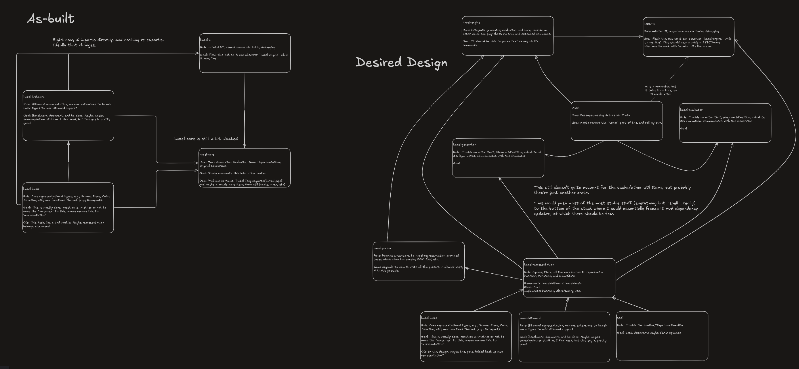

# 21-JUN-2024

## 1610

Working on getting this fixed up and functional, I updated dependencies, cleaned up some syntax
stuff, got a `flake` set up and `rustfmt` configured and running. I'll add precommits at some point
maybe.

I'm working on the pgn parsing issue, it appears to be failing to generate blocking moves for check.
It gets stuck on 26. .. Rf7 in the example fixture at tests/fixtures/no-variations.pgn. The `perft`
test is also over-counting the number of moves, so I need to figure out why it isn't seeing the rook
move.

I'm going to check out [bugstalker](https://github.com/godzie44/BugStalker) to see if it helps suss
out what's happening.

## 2115

I found the issue. I think my movegen was more or less fine? I added some logic about looking for
'blocking squares', but I don't actually know if it's necessary. I'll have to come back and test it
when I get to the refactor stage. Right now I've chased down a different bug which appears to be due
to `Game::from_fen/1` not calculating metadata from the FEN string. It ultimately delegates to
`Ply::from_fen/1`, which appears to incorrectly grant castling rights to black, which is incorrect.
I suspect this is because `Metadata::default()` grants castling rights, but in the event I see the
`-` value, I don't do anything, which means it breaks.

## 2133

I got everything pushed up onto `main`, switched the branch over, and need to just do a few more
cleanup tasks before I can set the repo to open.

## 2147

Added a LICENSE (AGPLv3), README, and uncommented the next tier of `perft`, which is failing due to
unimplemented `EP_CAPTURE` in the `src/ply/make.rs` module.

For now, it's good enough to go live I think. I still need to chase out some dependabot warnings,
but that shouldn't be too hard

# 22-JUN-2024

## 0143

Worked a bit on EP_CAPTURE, but it appears that the `unmake` method marked `todo!()` that I started
implementing isn't actully getting called in my test that explicitly exercises the unmake function
for this. It seems to be failing further up the chain, so I managed to stumble on a different bug
while trying to get perft working up to 6-ply.

## 1221

I think the issue may be that it's not properly recording that the previous move was an en passant?

## 1318

I've got it figured out, I just needed to do some calculation to get all the pieces moved correctly.
I need to add another couple tests for en passant on the edge files, one for an EP by black on
white, and a few other cases, but I suspect `perft` will reveal if there are any such issues.

## 2117


```
2024-06-22T21:48:00.245032Z DEBUG perft_start_position_to_depth_6:perft{depth=5}:perft{depth=4}:perft{depth=3}:perft{depth=2}:perft{depth=1}: hazel::game: 
8 | r . b q k b n r
7 | p . p p p p p p
6 | n P . . . . . .
5 | . . . . . . . .
4 | . . . . . . . .
3 | . . . . . . . .
2 | . P P P P P P P
1 | R N B Q K B N R
    a b c d e f g h
    Black to play

2024-06-22T21:48:00.245161Z DEBUG perft_start_position_to_depth_6:perft{depth=5}:perft{depth=4}:perft{depth=3}:perft{depth=2}:perft{depth=1}: hazel::game: 
8 | r . b q k b n r
7 | p . p p p p p p
6 | n P . . . . . .
5 | p P . . . . . .
4 | . . . . . . . .
3 | . P . . . . . .
2 | . . P P P P P P
1 | R N B Q K B N R
    a b c d e f g h
    Black to play
```

This is where the bug is introduced. In the first Ply, White plays axb6, and in the second Ply, the
`unmake` function has been called but did not properly accomplish the unmove. By the time we see it,
White has played b3, but the board is in an incorrect state because the en passant didn't unwind
properly.

I'm not 100% sure what I did wrong, but I think the answer is probably to add a bunch more tests.

One thing I could do is have each ply have a pointer to a 'previous' ply, rather than maintaining a
full history in the ply itself. This would trivialize the `unmake` function, but at the cost of way
more memory use (I think).

I think the first step is to analyze the `unmake` side of the en passant, and make sure it works
consistently. I'm looking forward to when I have the movegen side of this working correctly, so I
can refactor it to be less of a giant megamethod, I think at least some of my pain is found there.

# 30-JUN-2024

## 0102

Been working on the EP_CAPTURE issue, I ended up just deleting the implementation, walking away for
a bit, then reimplementing. I ended up doing it a slightly different way than the inital bit
mangling trick I was trying, and I think I'm just going to leave it as is for now. I think the bit
mangling will be faster and I was probably just doing it wrong, but I can leave the optimization for
another day.

I added some better error output for the unrecoverable error branch, and managed to get the `perft`
test running (but getting a different count of positions than it should).

I need to set up some kind of integration test w/ a known-good engine. I think I might try switching
off the movegen for a bit and work on the UCI implementation and maybe a little TUI for debugging. I
could then ostensibly get it and stockfish talking to each other, and it could then start perfting
and having SF verify the results, so I can start to see the game state that led to it overcounting.

In any case, for now, EP_CAPTURE I think is working, and I won't really be able to track down the
bug until I build up some better tools for debugging.

## 1838

A rough design:

Hazel: The main thread, spawns:
    - Grid: A list of engine instances, defaulting to Hazel, but allowing arbitrary UCI connections
      to other engines.
    - UI: The UI thread
    - Race Control: Which sends commands between engines / the UI, may be part of the main Hazel thread
      instead of it's own thing, not really sure.

The idea is to let Hazel have a sort of 'tournament management' feature, where it can run multiple
different engines and manage games between them, and also allow for deep integration tests as above.

The Engine Instance is a UCI Socket for communicating to the engine, which Hazel manages and the UI
allows selection between, messages are proxied down to the actual engine instance, which is just
running it's own UCI client reading from the same socket.

# 1-JUL-2024

## 2242

Got the Ratatui UI roughed in; also sketched out a plan for the debugging
interface/engine-tournament-manager thing. I'm off on a rabbit trail, but it seems fun so probably
worth doing. 

The first thing I want to do is get some sort of widget built to display a chessboard, I don't think
that should be too difficult, since I've got half an implementation in the Debug impl for Ply.

I can't say I know enough about `ratatui` so far to have an opinion, but I'll say for sure that the
markup-in-Rust thing is not my favorite. Copilot actually helps a bit here, these APIs kind of suck
to remember; I frequently get simple transpotition errors where I miscapitalize or whatever. Copilot
eventually figures out what I'm trying to do and at least makes the mistakes for me, so I'm just
fixing what it fucks up instead of me making the mistake and feeling bad about it.

## 2307

Futzing more, I think it makes sense to include all the UI stuff in the library proper, and maybe
just gate it by a feature someday. I can implement widgets directly against the types in the
library, which seems nicer than having to wrap things in a newtype to widget them.

I'm definitely not quite doing it right w/ rendering, this is because I'm procrastinating reading
the rest of this tutorial.

# 3-JUL-2024

## 0941

I think the UI is in a good spot to leave for a minute while I bring in some of the components that
need the UI. The first round is a simple UCI REPL; I should be able to type raw UCI into the UI and
have it respond (probably with dummy info for now). It should expose an option "current engine" that
points to the relevant backend by name.

I also managed to re-introduce an en passant bug, I'm going to leave it for now; I started on a
refactored movegen module before I put the project down last time, I think that's probably the
'right' way to chase out these bugs, and I think having a better debugging tool will help a lot in
figuring out what the issue is.

## 1145

I've roughed in the UCI repl a bit, just the parsing stuff. I'm going to get a basic
parse-to-an-enum, then refactor to use Hazel types for Moves/etc. Those are generic enough that it
should help with forwarding UCI around but also being ergonomic enough to use directly in the UI and
for Hazel.

## 1320

Fully roughed in, no type fanciness yes, but I'll enrich the parsing as I need it. I think the next
step is to get the OCI connection started up, and then work on a backend which proxies the OCI
connection to the backend engine.

## 1335

I think I need to learn `tokio`. I keep hemming and hawing about just writing my own threadpool
thing, but I should probably learn the 'real' tool instead of rolling my own here. Time for more
tutorial reading, I guess.

Or not, [this article](https://corrode.dev/blog/async/) suggests that maybe threads are just fine. I
don't know that this needs to be such a giant thing, I'm comfortable having lots of otherwise idle
threads with connections open. I suppose maybe a better approach would be to have a
thread-per-engine, and then keep them in a pool. I suppose I could have `Grid` be abstract across
any `Engine`, and then have `Engine` be a trait which, e.g., `HazelEngine` might implement.

The trait would just expect a way to send it UCI messages and recieve them in return. Eventually I
can place another variant which supports, e.g., a protobuf-defined API or something. The API would
have a `raw_uci` message so you could always fall back to just parsing UCI, but for richer queries I
could extend it.

I think I'll skip `tokio` for now and stick with threads until it starts hurting.


## 2143

Definitely a pass on `tokio`, the docs say that I'm probably not the right case for it right now,
and if I can go with a threaded approach, go with a threaded approach, so that sounds like a good
reason to me.

I'm going to work on getting the 'Driver' part of Hazel working, that's going to be the thing that
actually takes UCI messages and plays the game. My goal is going to be to integrate the UCI parser I
just wrote with the `Game` struct, and implement whichever commands feel easy and bail on the rest.
That should be enough for me to hook hazel up to an OTS GUI, and then I can get something relatively
bug free working on a known-good GUI before working to implement my own. I can also hopefully hook
up my UI and the OTS one at the same time, so I can compare when debugging.


# 4-JUL-2024

## 1713

Been picking at this all day, managed to get Arena to connect to Hazel and for Hazel to dump it's
logs somewhere other than STDOUT. I imagine I could have the thing continue to dump logs to STDOUT
but I'm not sure if that'll cause weirdness later with the UI, so I'm just going to leave it sending
to `/tmp/hazel.log` until I have some UI in place.

I think I'm going to work towards getting it making random moves and generally implementing the rest
of UCI for now. I also want to get it so that when `debug` is turned on, the `debug` log level is
set on the subscriber, and otherwise leave it at `info`. That way I can continue to use Arena as a
debugging mechanism.

I slapped together a couple scripts for running `cargo test` and `cargo build` with warnings
suppressed. I wish this was an option on the command itself instead of a flag. I recognize the 'good
practice' of always leaving these on, but I think it's a little misguided, most of the time I
prioritize fixing the thing I'm working on, and because the error occasionally pop up in the middle
of all the warnings, it's hard to track down the error amidst them.

I did a little experimenting with `watchman` and I think it may be worth a little hackery to come up
with something that will automatically, incrementally rerun tests and give you a little grid display
+ log output of failing tests. Mostly I want it to exist, I don't know that I actually want to build
such a thing.

In any case, good progress today, hopefully I can get most of the protocol implemented and see if it
can help me debug any of the weird EP bugs I've been seeing.

# 18-SEP-2024

## 1505

Stuck on a work problem, decided to commit off some work here while thinking about it. Several
things are in flight here but I haven't been back fore a while because I simply can't bring myself
to work on UI code. I'm procrastinating even now.

I'm debating whether I want a special 'Hazel' widget that can bypass the UCI interface, or if I want
to support a sort of UCI+ interface that allows for custom commands to be passed through, so I can
just focus on using an existing UCI interface. I'm probably going to branch off and work on both,
because making decisions is hard.

# 20-SEP-2024

## 0104

I've roughed in the UI model/viewmodel layout, and also made a quick 'driver' that talks to
stockfish over my UCI protocol implementation. I also set up an implementation of Stockfish's `d`
command and more generally I think I'm going to work on building up a UCI+ style implementation for
now, with an eventual goal of supporting multiple distinct protocols and transports.

I'm already seeing the UI side of this being separable, but for the moment I think there is some
benefit to keeping it embedded, in particular for building deep analysis tooling into the engine.

The next step is to start building widgets that query against the `RaceControl` backend. I want to
try to set up threading early in the UI so I suspect the way the widget is managing state might be
subject to a lot of change.

# 24-SEP-2024

## 1932

I've got things looking a bit more operational now. I've refactored the UI a lot to be more aligned 
with the tutorial, and I've created a skeleton for the datamodel.

I also refactored some of the terminal handling stuff, and chased some bugs in the stockfish wrapper
implementation.

I started on a `mask.rs` which is going to supercede that stockfish module and be able to manage any
STDIO/unix-y process, which should help with future scaling, but it's tricky and I'm debating
whether I should just bite the `tokio` bullet or not.

Next step is to improve things by getting state tracking set up on the Hazel side, since engines
generally don't have ways to display their boardstate (stockfish being a notable exception).

I think I do have enough now to write a test that tries to 'play' random moves (generated by Hazel)
for both sides and tries to see if stockfish and hazel ever disagree (including the PGN used to get
there as well).

I did a little coverage testing and I need to get that automated, so somewhere in here there's going
to be some github action setup to do.

I think I'm close to mergable, though the UI is total trash, I'd prefer to keep developing on main,
so I'll probably merge soon, perhaps after taking a detour to chase out that damn en passant bug.


## 2121

I chased down that en passant bug, I believe it was a bad metadata provided in the unmake call, but
probably I should be calculating the 'correct' metadata from the 'unmade' moves metadata. The whole
`Ply` struct is pretty cooked, tbh.

Anyway, back to `main` I go.

# 26-SEP-2024

## 2034

I set up a `mask` util object, but this is going to require refactoring `Engine` before I can use
it. I think I can create a second trait, `AsyncEngine`, which wraps `Engine`, allowing for both.

I think I need to switch to only returning messages one at a time, rather than trying to eagerly
read. All this needs to factor into the UI as well, which is going to be a bunch of work as well.

For now, I think I can progress with the blocking version and try to get the UI 'working' to some
extent with a stockfish backend. Thus back to the UI I guess. Logging output and text-to-stdin input
next, I think.

# 27-SEP-2024

## 0145

I have foolishly stayed up too late working on this, but I've got the UI in a good spot. I think I've identified the
mistake in my approach, in particular, I'm trying to extract modules/structs too early, I should start with state living
on Hazel and extract the widgets I need as methods, then abstract the state away in bigger chunks.


# 29-SEP-2024

## 1014

I've added a 'placeholder' widget so I can work more from the top-down on the UI. I designed a UI in the `ui-sketch.md`
and I'm going to start working towards that now that I have a concept of what I want things to look like. My hope is
that I can start with the layout of mostly `placeholder` invokes. The whole layout expects a static size, and eventually
I want the UI to just be a window on a larger, statically rendered 'infinite canvas' type of thing.

I should emphasize that I am not a UI/UX guy and I'm basically making this up as I go, but I think it'll be cool.

# 1-OCT-2024

## 1739

A little idea I had to improve board management.

I want to have a single `MoveType` that is respected across boards, and to me, that really comes down to that
`Alteration` idea I used in the `Pieceboard` type. In particular, I reduced from thinking about a move as a monolithic
enum like:

```rust
pub enum MoveType {
    QUIET = 0b0000,
    DOUBLE_PAWN = 0b0001,
    SHORT_CASTLE = 0b0010,
    LONG_CASTLE = 0b0011,
    CAPTURE = 0b0100,
    EP_CAPTURE = 0b0101,
    UNUSED_1 = 0b0110,   // NOTE: unused at the moment
    ///
    /// UCI sends moves in a simplified long algebraic notation that simply specifies:
    ///
    /// 1. source square
    /// 2. target square
    /// 3. promotion piece (if any)
    ///
    /// For Hazel, more is expected of the move metadata, but calculating it requires knowing the
    /// game state. This value is used to indicate that the move metadata is ambiguous and needs to
    /// be calculated.
    /// 
    UCI_AMBIGUOUS = 0b0111,
    PROMOTION_KNIGHT = 0b1000,
    PROMOTION_BISHOP = 0b1001,
    PROMOTION_ROOK = 0b1010,
    PROMOTION_QUEEN = 0b1011,
    PROMOTION_CAPTURE_KNIGHT = 0b1100,
    PROMOTION_CAPTURE_BISHOP = 0b1101,
    PROMOTION_CAPTURE_ROOK = 0b1110,
    PROMOTION_CAPTURE_QUEEN = 0b1111,
}
```

Coupled with some location information, I can instead think of a move as entirely defined by a series of simpler
`Alteration`s to the board.

```
enum Alteration {
    Remove(Location, Color, Piece),
    Place(Location, Color, Piece),
    Comment(&'static str)
}
```

A location is a compact representation of a spot on the board, the Piece is a compact representation of a piece, since
there are 64 squares and 6 possible pieces, and 2 colors, then there these can be tightly packed into a single byte. A
move may be multiple 'alterations' e.g., a Capture a black pawn on `e4` with a Knight by White would be:

```rust
Comment("1. Ne4 ...")
Remove(e4, Black, Pawn)   // Remove the target piece, the piece metadata here is used for unmoving.
Remove(d2, White, Knight) // Remove the source piece from it's original location.
Place(e4, White, Knight)  // Place it in it's new location.
```

The `Comment` allows for some clever tricks later. This representation means we can represent the game state as a series
of trivially reversible alterations, and we can use the `Comment` to act as a checkpoint to know when we've unwound
enough. Every board representation can, ultimately, just implement some parser for these alterations, and then we can
decouple make/unmake from the board representation entirely. Movegen would query a representation of the board, generate
a bunch of `Move`s, which can then be 'compiled' as alterations.

It also means that internally, the engine can happily keep a couple different representations in various stages of the
game tree depending on what the engine might need for evaluation. It can have a pieceboard rep, perhaps, for doing one
kind of analysis where the pieceboard is convenient, and so long as it is only working on that analysis, it can keep it
up to date to the exclusion of other reps. Similarly, it can roll forward or back as needed.

This also makes it much easier to maintain UI-friendly represnetations that can benefit from the faster internal
representations. We can pick up the list of alterations and apply them unchanged.

Ultimately this boils down to a `BoardRepresentation` trait which looks like:

```rust
type Move = Vec<Alteration>;

trait BoardRepresentation {
    fn make(&mut self, alteration: Alteration);
}

pub fn unmake<BR>(board: &mut BR, alteration: Alteration) where BR: BoardRepresentation {
    board.make(!alteration);
}

trait MoveGenerator {
    // Calculate _all_ (not necessarily only legal) forward moves from the current position.
    fn moves(&self) -> Vec<Move>;
}

trait LegalMoveGenerator {
    // Calculate only legal moves from the current position.
    fn legal_moves(&self) -> Vec<Move>;
}

```

This will make it easy to differentiate between UI/Non-UI reps (e.g., whether it implements MoveGenerator or
LegalMoveGenerator). Meanwhile, `!` starts to do some heavy lifting because:

```
impl Not<Alteration> for Alteration {
    fn not(self) -> Alteration {
        match self {
            Remove(loc, color, piece) => Place(loc, color, piece),
            Place(loc, color, piece) => Remove(loc, color, piece),
            Comment(c) => Comment(c),
        }
    }
}
```

For completeness, every move type is represented:


```
Quiet(src, dest):
    src_color, src_piece = get(src)
    Place(dest, src_color, src_piece)
    Remove(dest, src_color, src_piece)

ShortCastle(color):
    if color == White:
        Place(6, White, King)
        Remove(4, White, King)
        Place(5, White, Rook)
        Remove(7, White, Rook)
    else:
        Place(62, Black, King)
        Remove(60, Black, King)
        Place(61, Black, Rook)
        Remove(63, Black, Rook)

LongCastle(color):
    if color == White:
        Place(2, White, King)
        Remove(4, White, King)
        Place(3, White, Rook)
        Remove(0, White, Rook)
    else:
        Place(58, Black, King)
        Remove(60, Black, King)
        Place(59, Black, Rook)
        Remove(56, Black, Rook)

Capture(src, dest):
    src_color, src_piece = get(src)
    Place(dest, src_color, src_piece)
    Remove(dest, src_color, src_piece)
    Remove(src, src_color, src_piece)

EnPassant(src, dest):
    src_color, src_piece = get(src)
    Place(dest, src_color, src_piece)
    Remove(dest, src_color, Pawn)
    Remove(dest, !src_color, Pawn)


Promotion(src, dest, piece):
    src_color, src_piece = get(src)
    Place(dest, src_color, piece)
    Remove(dest, src_color, src_piece)

PromotionCapture(src, dest, piece):
    src_color, src_piece = get(src)
    Place(dest, src_color, piece)
    Remove(dest, src_color, src_piece)
    Remove(dest, !src_color, piece)
```

These rely on an assumed internal 'get' function that retrieves the piece at a location, but I think that's too low
level to include in the trait, since `get` might be different depending on context and how you want to implement things.

In any case, this should (I think) make for a bit of an easier make/unmake system. It _may_ be possible to make it fully
piece/color agnostic, but I haven't thought it that far through yet.

# 3-OCT-2024

## 2049

Working on getting the UI to be 'reactive', and my heirarchy is making for a real annoying problem of having to thread
the various bits of state through the UI, it would be convenient but clumsy to have it all in a single object on Hazel,
laying out the UI a little more rigidly there would probably work, I think I could simply render to an internal
'infinite' buffer and then grab a XxY view to actually render to the screen.

I think a more elegant way, though, is to make the main UI object an async object and have it run a little message queue
that each widget can listen for events addressed to it on. So the handler would grab the event, parse it based on the
current UI state, and enqueue a message which can be seen by any widget and reacted to. This would allow for each widget
to manage all it's own internal state, just by subscribing to this message queue. Leaving the object structure to
represent the DOM, essentially.

Did I accidentally re-invent React? I don't know, just seems logical to me, I'm not a UI programmer.

For the moment I'm just going to eat crow and thread everything through, it's ugly but it will work.


# 4-OCT-2024

## 2339

While working on the UI yesterday and a bit today, I thought I was going to have the opportunity to do some extremely
cursed things with unicode variables and stuff, but alas it was not to be. I did, however, make this at one point:


```rust

let table = Table::new([
    Row::new(vec!["┌", "─", "─", "─", "┬", "─", "─", "─", "┬", "─", "─", "─", "┬", "─", "─", "─", "┬", "─", "─", "─", "┬", "─", "─", "─", "┬", "─", "─", "─", "┬", "─", "─", "─", "┐"]),
    Row::new(vec!["│", " ", "♜", " ", "│", " ", "♞", " ", "│", " ", "♝", " ", "│", " ", "♛", " ", "│", " ", "♚", " ", "│", " ", "♝", " ", "│", " ", "♞", " ", "│", " ", "♜", " ", "│"]),
    Row::new(vec!["├", "─", "─", "─", "┼", "─", "─", "─", "┼", "─", "─", "─", "┼", "─", "─", "─", "┼", "─", "─", "─", "┼", "─", "─", "─", "┼", "─", "─", "─", "┼", "─", "─", "─", "┤"]),
    Row::new(vec!["│", " ", "♟", " ", "│", " ", "♟", " ", "│", " ", "♟", " ", "│", " ", "♟", " ", "│", " ", "♟", " ", "│", " ", "♟", " ", "│", " ", "♟", " ", "│", " ", "♟", " ", "│"]),
    Row::new(vec!["├", "─", "─", "─", "┼", "─", "─", "─", "┼", "─", "─", "─", "┼", "─", "─", "─", "┼", "─", "─", "─", "┼", "─", "─", "─", "┼", "─", "─", "─", "┼", "─", "─", "─", "┤"]),
    Row::new(vec!["│", " ", " ", " ", "│", " ", " ", " ", "│", " ", " ", " ", "│", " ", " ", " ", "│", " ", " ", " ", "│", " ", " ", " ", "│", " ", " ", " ", "│", " ", " ", " ", "│"]),
    Row::new(vec!["├", "─", "─", "─", "┼", "─", "─", "─", "┼", "─", "─", "─", "┼", "─", "─", "─", "┼", "─", "─", "─", "┼", "─", "─", "─", "┼", "─", "─", "─", "┼", "─", "─", "─", "┤"]),
    Row::new(vec!["│", " ", " ", " ", "│", " ", " ", " ", "│", " ", " ", " ", "│", " ", " ", " ", "│", " ", " ", " ", "│", " ", " ", " ", "│", " ", " ", " ", "│", " ", " ", " ", "│"]),
    Row::new(vec!["├", "─", "─", "─", "┼", "─", "─", "─", "┼", "─", "─", "─", "┼", "─", "─", "─", "┼", "─", "─", "─", "┼", "─", "─", "─", "┼", "─", "─", "─", "┼", "─", "─", "─", "┤"]),
    Row::new(vec!["│", " ", " ", " ", "│", " ", " ", " ", "│", " ", " ", " ", "│", " ", " ", " ", "│", " ", " ", " ", "│", " ", " ", " ", "│", " ", " ", " ", "│", " ", " ", " ", "│"]),
    Row::new(vec!["├", "─", "─", "─", "┼", "─", "─", "─", "┼", "─", "─", "─", "┼", "─", "─", "─", "┼", "─", "─", "─", "┼", "─", "─", "─", "┼", "─", "─", "─", "┼", "─", "─", "─", "┤"]),
    Row::new(vec!["│", " ", " ", " ", "│", " ", " ", " ", "│", " ", " ", " ", "│", " ", " ", " ", "│", " ", " ", " ", "│", " ", " ", " ", "│", " ", " ", " ", "│", " ", " ", " ", "│"]),
    Row::new(vec!["├", "─", "─", "─", "┼", "─", "─", "─", "┼", "─", "─", "─", "┼", "─", "─", "─", "┼", "─", "─", "─", "┼", "─", "─", "─", "┼", "─", "─", "─", "┼", "─", "─", "─", "┤"]),
    Row::new(vec!["│", " ", "♙", " ", "│", " ", "♙", " ", "│", " ", "♙", " ", "│", " ", "♙", " ", "│", " ", "♙", " ", "│", " ", "♙", " ", "│", " ", "♙", " ", "│", " ", "♙", " ", "│"]),
    Row::new(vec!["├", "─", "─", "─", "┼", "─", "─", "─", "┼", "─", "─", "─", "┼", "─", "─", "─", "┼", "─", "─", "─", "┼", "─", "─", "─", "┼", "─", "─", "─", "┼", "─", "─", "─", "┤"]),
    Row::new(vec!["│", " ", "♖", " ", "│", " ", "♘", " ", "│", " ", "♗", " ", "│", " ", "♕", " ", "│", " ", "♔", " ", "│", " ", "♗", " ", "│", " ", "♘", " ", "│", " ", "♖", " ", "│"]),
    Row::new(vec!["└", "─", "─", "─", "┴", "─", "─", "─", "┴", "─", "─", "─", "┴", "─", "─", "─", "┴", "─", "─", "─", "┴", "─", "─", "─", "┴", "─", "─", "─", "┴", "─", "─", "─", "┘"]),


], Constraint::from_maxes(vec![1].repeat(33)))
.column_spacing(0)
.style(
    Style::default().bg(Color::White).fg(Color::Black)
);
```

Which is beautiful in both rendering and absolute piss-elegance. I did not want it to go to waste in /dev/null, so I
have recorded it here.


# 5-OCT-2024

## 0015

These too:

```rust

const EMPTY : &'static str = " ";

const HORIZONTAL : &'static str = "─";
const TOP_LEFT_CORNER : &'static str = "┌";
const TOP_RIGHT_CORNER : &'static str = "┐";
const BOTTOM_LEFT_CORNER : &'static str = "└";
const BOTTOM_RIGHT_CORNER : &'static str = "┘";
const VERTICAL : &'static str = "│";
const CROSS : &'static str = "┼";
const TEE_RIGHT : &'static str = "├";
const TEE_LEFT : &'static str = "┤";
const TEE_DOWN : &'static str = "┬";
const TEE_UP : &'static str = "┴";

const TRANSPARENT_ROOK : &'static str = "♖";
const TRANSPARENT_KNIGHT : &'static str = "♘";
const TRANSPARENT_BISHOP : &'static str = "♗";
const TRANSPARENT_QUEEN : &'static str = "♕";
const TRANSPARENT_KING : &'static str = "♔";
const TRANSPARENT_PAWN : &'static str = "♙";

```

They may be useful again someday.

## 2143

I got things cleaned up and merged, I think the board is basically done for now. It's pointed out a need to extract some
of the UI to configuration, so I can change it more easily. I dislike the unicode pieces a lot, I imagine it's just the
font I'm using not being particular legible, but I think I want to aim in a direction of sprites rendered using a
terminal image api. This is a little bit trickier, and think my time is better spent elsewhere right now. When I do
that, I'll spend some time looking at custom font patching as well, as keeping it all text is pretty nice, and I don't
think it'd be too difficult to make some better looking pieces.

I think next I want to set up an integration test, the goal will be to evaluate some deep `perft`, and send the games
off to be 'validated' by `stockfish`, ideally in parallel (on both sides).

The idea would require building some better abstractions around `Engine`s, and would also work towards finishing the
movegen component. I do want to build the `Alteration` based model; but I think I'm close enough with my initial, naive
approach that it's worth bringing to completion if I can before starting on the next version.

I do want to get the UI finished soon, but it needs some design review, as the current deeply nested approach is a
little tricky without some distinct 'main loop'. This should be straightforward to build with `tokio`, but I need to
take some time to do it.

I've been working with `worktrees` recently; and I'm debating just having three branches running so I can switch between
subtasks. It'll make the `LOG` a little weird to maintain though -- parallel universes. Maybe I'll start adding the
branch to the entry? It should be a straightforward merge process.

I suppose I'll know by the next entry.

## 2201 - movegen-v2

Hi from a worktree. This worktree will track work on the 'movegen-v2', which is a new approach to tracking gamestate and
generating moves. I expect this branch to merge once over it's lifespan. I'm running a few of these worktrees
simultaneously, experimenting with the model, we'll see if it works.


# 8-OCT-2024

## 1827 - movegen-v2

Got some initial work done getting a better game-tracking structure in place (`HalfPly`) and tying it to the existing
`Move` struct. I also was able to abstract away a lot of the board rep stuff behind some interfaces.

Remaining is to organize the various `move` related code and start tearing out the old crappy stuff and building
something better. I briefly took a look in `notation-spike` at doing some const-time notation stuff, but I'm stymied by
the half-implementation there.

I've got plenty to do on this side now that the HalfPly work is done, I can start to build up the `Line` struct and
build up to something that'll replace the current `Game` struct.

Once that's done, I can start work on a movegen/legality checker. I think I want to build this as a collection of
small services, one to generate all moves (no legality checking), a second to check for legality independently, and
later evaluation services that can provide various evaluations, these evaluation tools can be tagged and run
independently to compare them to each other in situ. The main process will spawn a process which has the engine backend
and the some frontend that tracks boardstate, options-per-engine, etc. The main process can then spawn whatever child
processes it likes based on the request from the Engine.

It makes sense in my head, which means it almost certainly won't make sense anywhee else, but that's how it always goes.

# 10-OCT-2024

## 0017 - movegen-v2

Thinking about the `Notation` idea again. I think there is a different way I can approach it that won't encounter the
type problems I was having. In particular I can use an associated type to track the format of the notation, so that I
can convert internally between the formats.

Another option is just to have an unassociated family of types with mutual `From` implementations. One called `Index`,
one called `UCI`, and so on, then I can have them all be const impls, and everything in the crate can just use `Index`,
but with a const `into()` method which converts to the correct type at compile time?

I truly have no idea if that'll work, but it makes half sense in my head, and my lack of types for these things is
starting to hurt.

## 0100 - movegen-v2

I think I have a better plan now.

I'm going to reorganize the repo like this:


```

src/
    board/
        bit/         # Implementation of a bitboard-based representation. Not the bitboard type itself.
        piece/       # Implementation of a simpler array-of-objects representation.
        planned/     # ... there may be other representations I put here eventually as well.
        mod.rs       # Interface definitions and module stuff, Alter and Query live here.
    notation/
        # Some kind of notation management object, ideally mostly const-time, as a QoL thing. Much
        # easier to have a consistent way to represent notation, instead of the mix of octal and text and coords.
        index/    # Index-based move notation
        uci/      # UCI Move notation
        san/      # SAN Move notation
        fen/      # FEN gamestate parsing and generation
        pgn/      # PGN game history parsing and generation
        mod.rs
    move/
        rep/
            # This contains various compact move representations, and probably also the `alteration` type and it's
            # friends.
        gen/
            # Async Move generator, legality checker, etc.
    game/
        # This tracks the gamestate, it's home to:
        halfply/    # Represents a single move/
        line/
        variation/
        mod.rs       # The Game Representation object itself.
        interface.rs # The `Chess` trait goes here
    evaluator/
        # evaluation here, someday
    brain/
        # Async Hazel Engine
    engine/
        # UCI interface
        uci/
        driver/
            stockfish.rs # Wrapper around stockfish, for integration testing
            hazel.rs     # Hazel Engine implementation wrapper (wrapping brain.
            mod.rs
        mod.rs
    ui/
        model/
        widgets/
        app.rs
        mod.rs
    types/
        # generic/crossfunctional types that are used everywhere.
        bitboard/  # bitboard type implementation
        pextboard/ # pextboard type implementation
        mask/      # async process wrapper.
    constants/
        # Constants used throughout the program
```

It's a bit easier to see the structure of the thing that way. The 'brain' is the main process that the UI will spawn
and interact with. It will spawn the other components and maintain the engine state. I'd like it to have a little
scripting language/VM sort of thing to control it via the UI in richer ways than UCI would allow. Ultimately, like
everything, I want to make it's parts hotloadable so I can leave it running all the time and just reload the
subcomponents on the fly. Everything must scale to infinite machines, uptime must grow.

I'm not going to do this till I finish the new movegen stuff, which should get all the raw materials above (mod the
evaluator, movegen, and brain bits, I suppose) in place, and then I can start to reorganize and clean up some of the
duplication I have now.


# 12-OCT-2024

## 1500 - movegen-v2

I think I have to commit to the reorg now, but some things have changed which makes the above not _quite_ right. I
started to change it and I think I'm just going to get in and start moving things around on a clean commit of this
branch. After that I think I'm going to merge and go back to working on main. It turns out I'm not so great at sticking
to a single topic on a side project so branching isn't really what I need to do here, at least not till I've cleaned up
some of the tech mess I've left for myself.

Next update will hopefully have all that done and I can document it here.

Also on the list is going to be getting `mkdocs` set up for a wiki, and maybe a local docserver, if only to motivate me
to document more.

# 13-OCT-2024

## 2322 - movegen-v2

A great culling has occurred as I move things towards the unified `Square` approach to notation. I've more or less got
everything lined up, and am just chasing out bugs from the various bits that I tweaked incorrectly to return to
compiling. At time of writing, six failing tests remain.

The approach I took seems alright, though it was tricky in spots. Essentially I have everything rely on an implementor
of `SquareNotation`, which requires the implementor be capable of converting to a `Square`, which is a simple newtype
around `usize` that constrains to `0..64` and provides some convenient const-time functions for working with it. The
trait wraps and provides those functions for general use, eventually it would be nice to push as much to const-time
evaluation as possible.

This should make it easy to have alternative implementations I can experiment with if I find better represnetaitons
later, and should smooth the cutover should the need arise.

After getting `Square` setup throughout, I plan to do the same thing with `Move`, building my current, compact `Move`
representation into the 'Default' `MoveNotation` implementation, similar to `SquareNotation` and `Square`. Also `FEN`
needs to be factoryed in throughout. Here it will be much more likely that thr trait will be valuable, as there are lots
of different move representation schemes, so by implementing the trait, I can set up a canonical pipeline to convert
between different representations. Something like:

```rust

pub fn convert<M, N>(m: M) -> N where M: MoveNotation, N: MoveNotation {
    let i = Move::from<m>;
    N::from(i)
}

```

I don't think it's possible to write the more general:

```rust

impl<M, N> From<N> for M where M: MoveNotation, N: MoveNotation {
    fn from(n: N) -> M {
        let i = Move::from(n);
        M::from(i)
    }
}

```

because of orphan instances, but I think the first is good enough for now. I can always add more implementations later,
and within hazel, it's most likely that I'll want to move to `Move` anyway.

Lots of gruntwork to do, but I think the result will be worth it.

# 16-OCT-2024

## 2104

I merged it. I got everything working again and I merged it. I was able to delete a ton of old code that wasn't needed,
and really improve the ergonomics of working in `hazel`. Now that it's at least partially done, let me take stock of
where things live and what it cost.


### Costs:

I binned the `NOTATION_TO_INDEX` and related constant lookup tables, and replaced them with a common `Square` type that
is tucked behind a `SquareNotation` trait. This leaves a door open to change this later, but for the moment having a
consistent type for referring to squares everywhere, and allowing me to easily convert between rank/file/index is very
handy. Saves me writing octal constants everywhere, too.

I also deleted, more impactffully, the `Game` and Ply` types, these were trying to do way too much, and I have a better
approach in mind. This does mean I gave up my progress towards `perft`, but I think I can bet back there in a more
stable configuration and not have to worry about carrying the mess with me.

Two weeks of work, and I'm technically behind where I was, but I think it was worth it.

Oh, and the benchmarks are toast. I changed a lot of the bitboard API and that's all that really had benchmarks. I'm
going to get the thing fully working and then go back and write benches. Originally I had started this as a reason to
learn `criterion`, but rapidly I found I was less interested in chasing performance then in the core problem of a chess
engine itself, so it bitrot.

### Benefits and new Design

The main benefit is that this enables moving forward with a new design. The organization is slightly improved. It looks
like this now.


```

src/
    board/
        # Board Representation
        interface/
        <board reps>
    brain/
        # Primary Subsystem, manages all the other processes.
    constants/
        # Useful _constants_
    coup/
        # Move related code
        rep/
            # Move representation
        gen/
            # Move Generation
    engine/
        # UCI Interface Substystem
    evaluator/
        # Position Evaluation Subsystem
    game/
        # Game State Representation
    notation/
        # Notation Representation + Conversion to internal canonical formats.
        fen/
        uci/
        square/
        pgn/
        ...
    types/
        # General types that don't fit in other subsystems.
        bitboard/
        pextboard/
        color.rs
        direction.rs
        occupant.rs
        piece.rs
    ui/
        # UI code
        model/
            # View Models
        widgets/
            # Widgets
        app.rs
    util/
        # Utility functions and some types
```

Ultimately, the `hazel` lib will provide a single tokio process `hazel` which spawns a ``brain` process, which in turn
spawns whatever other subsystems it wants according to it's configuration. This will include a gamestate represnetaiton,
some way to speak UCI, evaluation and movegen, etc. The idea is that `brain` can dynamically adjust how it's set up,
connect with other hazel instances, etc.

The `hazel` process can also optionally spawn a UI, which will allow deeper insight into the engine state.

Already existing is an ability to wrap other engines, so another subproject here is to build some cross-testing tools as
well.

So the thing looks roughly like:

```

Hazel
|               /--A- Engine Driver Backend
|               |
|------ Brain --|--A- Move Generator(s)
|               |
|               |---- Game State
|               |
|               \--A- Evaluator(s)
|
|
|
\------ UI

```

The `Hazel` process will be the main entrypoint, and will have a VM+scripting language to control it and the other
processes. This might be custom, for fun, not sure. I might just embed lua or something, like a responsible adult.

The goal would be to have a DSL that can load games, do analysis, process that analysis, etc. Less an engine to beat
other engines, more an engine to study positions efficiently, etc.

The next step is to rebuild the Game Representation, it's mostly done, but I want to get Move and PGN represented in the
notation module and Move's abstracted towards the `MoveNotation` trait similar to what I did for`SquareNotation`, and
`Square`. This is already underway as well.

After that, MoveGen and Perft. I still have the old `Ply` code so I can borrow from it where it makes sense. This is new
territory, I want to build it as a `tokio` process that speaks over some API. Ultimately I want `hazel` to be natively
multi-system, so it can run it's components across any system you like, so building up the engine as a bunch of
independent components is going to be necessary. I'll probably take that opportunity to scaffold in the whole process,
and also get a diagnostic environment set up.

Somewhere in there I also want to make more progress on the UI.

My plan is to have two worktrees, `UI` and whatever thing I''m working on at the time. As I implement stuff, I can keep
chipping at the UI as I go.

# 31-OCT-2024

## 2007 - gamerep

Spooky season is 'pon us, and I have deleted a bunch of code. I've been working on the `Game` representation, and I
think I have the design down (almost)

The main problem, it seems, is metadata. In order to know, for instance, who is allowed to castle, I need to know if any
one of a number of events has occured over the course of the game up to this point. This can be calculated each time I
need it, and it is admittedly not the most expensive thing in the world, but it gets tricky when I need to know the
metadata state in a particular variation of a particular position and it can very rapidly get hairy.

The `Alter` system works really nicely for this, I have an `Alteration` struct that has much simpler primitive
operations to the board, so I though, "Can I extend this language?" and the answer is "Actually I should just build
another language."

So now I have `ChessRule`, which includes the higher level actions that 'compile' to this lower level 'alteration',
I've also added a couple alterations variants. `Clear` simply instructs the implementor to reset the state of the board
to nothing, and `Tag` allows a 4 byte 'tag' in the output that is otherwise ignored. These allow me to easily generate a
single stream of Alterations that can:

1. Describe the change to the boardstate over time
2. Represent arbitrary trees of games
3. Be easily 'compressed' to a 'compact' form (distinct from, but equivalent too, FEN) for any single boardstate

Since `Alteration`s are reversible (mod Clear, more in a sec), I can easily scroll forward and backward within the space
of a single 'clear' call, and if I need to rewind to before that, I just rewind back to the previous clear and rerun.

This leaves the existing `Alteration` stuff more or less unchanged, and allows me to use this new higher level language
to describe a chess game as a stream of `ChessRule`s, which can track higher level details. The Game Representation is
just a vector of `ChessRule` that gets `Move`s `#make`d on it, and when the move is made, the representation can also
add any number of metadata variants too, these then get 'compiled' in the current context and added to the vector of
`Alteration`s that then represent the game. The metadata gets added as `Tag` variants in the GameRep.

All this still requires a bunch of work and testing, in particular getting the `Tag` parts right is proving a little
tricky. I initially thought of sticking a [u8] slice in the tag, and I still, tbh, want to do that, but it ends up
touching a bunch of the system with lifetime annotations and that seems really lousy.

Current plan is just to power through till I get something that can represent a PGN and get that wired up to the UI,
maybe with some kind of insight from PGN -> ChessRule -> Alteration

A practical effect of this is also that many things currently implementing `Engine` really shouldn't, since they can't
track metadata, which makes a _ton_ of sense in retrospect. I kept trying to figure out how to reconcile why it felt so
weird that any board rep was a kind of 'engine', but in this model, they're not, they're just `Query + Alter`,
make and unmake are really part of another trait, `Play`, which is different than something which can be merely
'altered'; it implies an understanding and ability to track metadata for the given game. In my case, there is only one,
but I have a `Play` trait which specifies a particular included type, `Rule`, which takes the equivalent of the
`Alteration` struct (in this case, ChessRule) and has an `apply` and `unwind` method (and _mut variants) to apply and
... unwind the given 'Rule'[1] and track the metadata internal to the structure, the trait doesn't care about the
content or how that metadata is stored, just that it is.

Movegen can then take a state as compiled to `Alterations`, then start creating whatever moves it likes as `ChessRule`
variants piled on top, the `ChessRule` includes the idea of a `Variation` which is a delimited sequence of moves
branching off from the previous. These can be nested to create arbitrary structures. Seeking to a particular variation
involves simply unwinding from the variation backward until you find a `Clear`, and then reading back the result.

Now we get back to engines, Engines take UCI commands, `Play`able objects take `ChessRules` (or whatever other variant),
our system says every UCI command should translate to some set of `ChessRules` that can then be compiled to
`Alteration`s and applied to some `Alter + Query` object to represent the game. This allows a single representation
which can easily be tracked through, the resulting state can be 'compressed' to a `Clear`, a series of`Place`
operations, and then a set of `Tag`s to define the metadata, and this representation is easy to turn into any other
board representation you like. So if you want to use SIMDified bitboards, you just need to tell it how to process the
`Alteration` stream, and once it is in your domain, how you use that representation is your business. Once you want to
send results back, compile them to `Alteration` or `ChessRule`s (or even a mixed stream of them) and send them back.

I think this'll work well for my purpose, but I do expect I'm adding some amount of overhead compared to a direct
implementation. Fortunately, I should be able to test that later if I like by directly interpreting the `ChessRule`
without the `Alteration` layer, and that will give me some sense of how much overhead I'm adding by the extra jump.

[1] Here I'm doing a classic math thing of taking a word with a well known and well-understood meaning and using it in a
way which _almost_ fits that meaning but stretches it just a little past comfort. In normal terms, a 'rule' is an
assertion toward obedience. You have a rule that says "Thou shalt X", and you better be X-ing or else you're breaking
the rule.

However, rules can also be 'applied', as in, "Use L'Hopital's Rule to solve this limit". In this case, the rule is an
algorithm or technique or manipulation.

Rules can also be 'observed', as in "The rule of law", where the rule is a principle or standard that is generally
understood to be 'the way things work' and is used to guide behavior, though not strictly enforce obedience to some
particular interpretation.

In `Hazel`, a rule is simple 'An operation that can be applied to a gamestate'. It's a little bit of all three, but
really it's closest analog is an 'Arrow' between objects. In the "Category"[2] of all Chess games, where arrows are
game-legality-preserving moves between boardstates, a rule is associated with every one of those arrows.

[2] I don't actually know if this is a proper category, so maybe it's just a Graph with some extra steps, but I like to
think of it this way.

# 10-NOV-2024

## 1219 - gamerep

I've got `Variation` (formerly  Game, Line, HalfPly and Ply... it's been through a few iterations) basically working.
It can at least represent a simple variation, and while the API is going to need some finishwork, I think the design
works and I should be able to flatten a PGN into it.

I'm debating now between merging and tackling that in a separate PR, or just pushing through and getting it done. I
think I might try to push through and see how painful it is. If it comes together quickly then I'll go for it, but
otherwise I'll plan to merge and then tackle it in a separate PR.

I have an existing 'no-variations' PGN example I can use, and I think I should probably have the test exist in the
`tests/` subdir as it's more of an integration test than a unit test. I plan to use the `Shakmaty` PGN parser for now,
but would like to build my own eventually.

## 1628 - gamerep

I think I'm going to merge.

I also think I'm going to write my own parser (probably with `nom`, maybe fully by hand).

Here's why.

1. The next step really is a big change in design, I'm going to be doing parser stuff, it's not going to be particularly
   chess-y, and it *should* be pretty _simple_ believe it or not.
2. The model I have and the model the pgn-reader/shakmaty use are very different. I *should* be able to directly read a
   variation in a single pass, no visitors or whatever, just a single read to translate each move to the correct format.
   The OTS dependencies expect a visitor-pattern approach because they (rightly) believe most people won't be doing weird
   bytecode shit.
3. Doing it myself means I can drop a couple dependencies, which is very cool.

I'll probably use `nom`, but I may even try a simple RD parser myself, since the format is pretty simple. I will
probably build a `PGN` object that holds all the metadata and the actual variation, which can then be produced by/handed
off to the actual Engine.

# 15-NOV-2024 - pgn

## 2157

I'm writing the parser, it's going alright. I'm finding myself in want of a lot of QoL stuff so I'm splitting between them.

In particular, not being able to have a cheap, copy-able board representation like FEN was killing me, so I started
working on BEN, which is a relatively compact binary-encoded FEN equivalent. Insodoing I added `Alter` to `FEN` so it
technically counts as a whole Board Representation now. This led me to realize I've been using `PieceBoard` pretty
liberally as a way to make FEN alter-able, and I've unwittingly bound it quite tightly to a particular board
representation internally. It occured to me it would be pretty cheap to abstract this to a type alias that only claims
it's traits and no particular internal representation. So in principle something like:

```rust
type Board : impl Alter + Default + Query + Clone + Into<FEN> = PieceBoard;
```

Then I can use `Board` everywhere, and if I want to switch to a different representation, I can just change the type to
anything that implements the traits. Later I can add additional traits like:

```rust
type MoveGenOptimizedBoard : impl Alter + Default + Query + Clone + Into<FEN> = Bitboard;
type UIOptimized : impl Alter + Default + Query + Clone + Into<FEN> = CharBoard;
```

I suspect I'll want to introduce some kind of granularity here, I'm not sure the best way to do it, but I want to rely
on no specific board representation interally, but rather on a set of traits that can be implemented by any board
representation.

I'm premature in my optimization, but I can see that there will be a point where board representation becomes an
optimization path and I want to approach that in a structured way.

I suppose figuring out how to extract the generic `Board` type is the first step. 

## 2038 - pgn

I'm thinking a bit more about `Alteration` and what I should encode there. I think ultimately I do want to try to
encode the entire gamestate in the `Alteration` stream, which means encoding some sense of metadata, as well as game
events, and so on.

Each board representation implementation is going to be good at "something", it may be optimized for efficient movegen,
or for easy evaluation, etc. I think each `Alter` type should advertise which subset of the commands it implements.
During 'compilation', the 'compiler' will check this list and try, where possible, to provide implementations of
whatever keywords are missing. So for instance, if a BoardRep doesn't implement the 'Clear' command, the compiler will
replace it with 64 'Remove' tags, assuming it implements 'remove'.

As I build up the engine's abilities, I can add new commands, and so long as I can implement them in terms of the older
commands, I should be able to use the new command with any older board representation still, even if a bit slower. This
matters for the UI and non-engine-y parts of Hazel. Since the UI is a big part of how I plan to develop Hazel, I want to
build the UI to also read along the Log of ChessActions, which ultimately become a list of alterations.

Different consumers of that log stream can maintain a `Cursor` into the log and then ideally rewind/fastforward to any
state in the log. The composed object will implement `Alter` as the sum of it's internal implementations, and dispatch
commands to subcomponents as it pleases. So the UI's implementation of `Alter` might update it's UI oriented internal
state, while the Engine might instead be grabbing many alter's at once and applying them in batches somehow.


# 19-NOV-2024

## 2313 - pgn

I'm frustrated by the fact that PGN requires, essentially, an entire movegen system to parse. I'm going to hack in
something in the 'good enough' category so I can flesh out the Variation stuff and then probably put it down and go to
work on the MoveGen. I have an idea for it that I think will work well with the design I'm aiming for. In a surprise to
no one, it's copying the `Alter` system. I'm going to use the old movegen as a guide, and focus on building a system
that can implement a rich language for querying a boardstate. I can then use this to build a movegen system that is
abstract with respect to boardstate _and_ can abstractly describe different movegen calculation strategies that can then
be run against multiple backend boards.

An implementor would then have to implement some minimal set of operations, which all others must be expressed in terms
of, and then I can build different backend representations designed to make some operations faster.

Ultimately this will build up to a general language that can describe how to arrive at specific boardstates, and how to
do analysis downstream.

You'd have a script that describes some algorithm to tell the engine how to proceed from it's current position, what to
evaluate (e.g., maybe "find the top 100 lines from this position for white at depth `n` and then calculate the relative
power of the black bishop in each lines and report the distribution as a graph"), and then hazel would haul off and do
the work.

Each little language is really a part of this bigger language that ultimately 'compiles' to some glue language.

I was hoping to get `pgns` more fully and comfortably supported, but I don't think that's going to be possible right
now. I might still work on the Variation -> PGN (at least the mainline) so I can display it in the UI, but I'll have to
think about how much I want to keep writing parser/printer code.

# 20-NOV-2024

## 1141 - pgn

Having thought about it more overnight, I think my plan is thus:

1. Get the existing PGN parser to the closest thing to a working state as I can. Hack as needed
2. Merge
3. Extract and unify this 'minilanguage' thing I have going on into it's own abstraction (preparing for eventual parser
   writing for the Witchlang)
4. Build a better MoveGen system based on the enum-based approach

Ultimately Hazel (the engine bit) is going to have a `WitchLang`, which compiles to `WitchASM`, which is an Enum-y
language like what I have now. WitchLang will be a small scripting language that can be used to create more complex
queries that can then be optimized, similar to how a database query-plans.

Hazel (the engine) will be a small VM with some tools to alter it's scale, what represnetations are active, etc. It will
produce a stream of instructions to configure itself and solve any presented chess problem.

This will also allow for more asynchronous processing, e.g., the movegen can request a bunch of calculations, but the
engine can batch and cache these things, reach into existing cache, etc -- behind the scenes.

5. Get `perft` working for a few positions, matching stockfish

This milestone will be the big 'I've got a system working' moment; since from here it's just a matter of adding eval and
pruning tools to the results of the movegen. Ideally I'll be able to express some basic evaluation functions in the
WitchLang and then start looking to extend it to NNUE and the like. Ideally it's something like:

```
Engine Tune:
    Set parameters here
Search <Some FEN>
    Depth <some plycount>
    Prune With:
        Some subprogram
    Filter Final:
        Some subprogram
    Group By:
        Some subprogram
# etc
```

This gets compiled down to a series of `WitchASM` instructions that can be run on the engine, and then ideally the
language can express self-retuning as it iterates, etc. Ideally all the chess-related logic ends up in this language and
we then attack the problem like a compiler problem, optimizing to intermediate reps and building an engine that can
solve the given script optimally.

I think this will make for something very flexible, since most of the chess logic will live in the language and not the
engine itself. I suspect I may see some overhead, but I'm hoping the translation layers should mitigate some of that,
since the final set of instructions that the thing needs to execute should be somewhat smaller. Translating further down
to bytecode (and perhaps SIMD bytecode, since most of these operations should be parallelish) should be doable and
hopefully keep the speed sufficient to justify the flexibility on offer.

For Eval, I'm planning to build a bunch of different eval functions, but I'm particularly interested in NNUE and messing
around with different architectures using the NNUE concept. More SIMD in my future.

Ideally I'd like to get to the point where I have a suite of integration tests that:

1. Use WitchLang to load a PGN, do evaluation to it, and report statistics about the results.
2. Use WitchLang to perft from multiple different positions and compare statically to stockfish
3. Use WitchLang to generate a random position by playing random moves, then dynamically compare perft results with
   stockfish to the maximum depth achievable in a reasonable time.

Those three tests should fully exercise any movegen code I'm using; especially if I can set the number of PGNs pretty
high.

## 2136 - pgn

I ticked off #1 of the above and got past the ambiguity with sliding pieces. I even got to use some of the old bitboard
implementation.

I need to do some work to get variations parsing and the like, but I think the move generation is probably 'good enough'
that I shouldn't run into an ambiguity problem again.

I'm not tempting the gods, _you're_ tempting the gods!

# 23-NOV-2024

## 0048 - pgn

I added a fixme to mark where I left off, but I've managed a lot of progress on this parser. I switched to a different
approach that essentially focused on tokenizing the PGN to a much more convenient representation that was easy to shove
into the Variation structure. I'm only missing a few things:

1. Annotations need to be tokenized so they can be ignored correctly.
2. Comments similar
3. Better Section marking, I'm just marking start/end of file, the naming is bad, etc.
4. The current_position calculation for Variation needs to be modified/replaced to be able to calculate the position at
   the tip of the log.

I think those things get me enough to parse PGNs. It should also be possible to reverse this and generate a sequence of
tokens from a variation, which would make it very useful for comparing game trees and the like later on, also handy for
the UI.

I'm currently ignoring the turn marker, but embedding that in the variation could be a pretty handy way to track
different positions within the tree. I want to look into having a sort of 'detached' cursor that could be used to have
multiple referents to a single Variation, I think this will be helpful in lots of ways but it starts to venture into
bits of the borrow checker I've largely avoided.

Sounds like a problem for future me though.

## 1116 - pgn

Finished the annotations and comments from above.

## 2309 - pgn

I need to work a lot on how I navigate around the log.

There is a case, I think, for a specialized cursor that acts as a state machine over the log, that is where the game
tracking lives, a single log can have multiple cursors, which can be constantly growing and being pruned as the engine
works. It tweaks my design a little, but I think that's the next natural place to put effort. I think the parser is
properly handling PGNs now, so it's really 'done' and should be merged, the conversion to a variation is what's broken,
but it's separate from the 'current_position' problem that I think this will solve.

I also want to consider embedding the number of moves contained in a variation as part of the variation itself. This
would have to be done in a second pass after tokenization, but it would make the skip-ahead logic much easier.

I'm going to split this work into a new branch, then kill mutants until I can merge `pgn`. The tests for the actual
`pgn` class will be lacking, but I think I'll just have to make it up elsewhere.

# 26-NOV-2024

## 1252 - familiars

Continuing from previous entry, I'm starting to solidify the design of the playing-end of this thing.

I have this setup:

```

Log is a way to store a sequence of anything, in our case ChessActions

Chess Action supports a notion of 'Variation'

The Log lays out it's contents as single, seekable stream, similar to the File API.

Log can produce a Cursor or WriteHead (mutable cursor) on itself, which can be used to navigate the log.

A Familiar takes a Cursor and calculates some useful values, in particular the current board state and current metadata
information.

Familiars are generic, they only care that the type they work over implements `Play`, which itself is a trait that is
generic over the Rule and Metadata types that govern whatever abstract game they define.

A Familiar can be specialized to a specific representation type to allow for faster/more efficient calculation, it might
be responsible for caching important results, etc. Most directly, it's responsible for calculating the current board
and metadata state.

```

The final engine will essentially be a Log, a bunch of Familiars that can be created/destroyed as needed, and insodoing
I can have multiple representations that can all benefit from intraconversion. Familiars should have a 'Set Position
with cached state' option which allows one familiar to transfer it's state to another; so that a Familiar optimized for
fast scanning can then feed one that's designed for fast querying, etc.

This also means new representations can be easily compared apples-to-apples with exisitng representations.

# 30-NOV-2024

## 1049 - familiars

I'm thinking about some reorg. Part of the process of building `Familiar` has made it clear that what I have is quite
capable of representing pretty generically any kind of abstract perfect information game, and I'd like to preserve that
property and make it more explicit in the organization. I'm thinking of these changes:

1. [x] Move `src/game/` tree to have a `src/game/<name of abstract game>/<contents here>` structure, so I can represent
   other games.
2. Extract the `PositionMetadata` struct to this new location for the `chess` subdirectory.
3. [x] Move `board/interface` to the top level.
4. [x] Move `compiles_to` to the interface section, though presently it's unused and may remain there, I may leave this on a
   twig and remove it from the trunk, haven't decided yet.

`Hazel` can then have (ideally) a relatively abstract idea of what a game is, and can hopefully lead to some reuse with
some of the scaffolding (e.g., whatever alpha-beta/minimax/mcts/nnue bullshit I come up with) with other games. I'm
thinking primarily for fairychess, but also even something like `nim` for testing purposes could be handy. `nim` is an
extremely simple game, so it's possibly valuable for debugging and testing purposes, remains to be seen.

All of this should also provide a nice place to put a `Game` structure that can then implement `Play`, this should be
generic with respect to board representation and metadata representation, but canonically should use the
`PositionMetadata` struct for metadata, and any `Query + Alter` capable rep.

## 1114 - familiars

As of now, all but #2 is done, tests are passing, so time for a big commit.

## 2321 - familiars

I'm working on the last move from above, and I'm thinking of some further tweaks I want to consider.

In particular, I think I'm going to want to build an 'Index'/'Cache' system for `Log`. Eventually I want to be able to
refer to different parts of the log by different criteria. For instance, I might want to search the log for a specific
turn's position in a specific variation, I need to find the place in the log where that is, and I may want to cache that
position for later use, so I'm starting to think of what that might look like. In particular I suspect something like
the `familiar` system would be used to maintain that index and cache. Ultimately this sort of works as a file format for
a database, and `hazel` acts as an interface to that database.

# 10-DEC-2024

## 1314 - familiars

I've been chipping away at this and I've gone for a bit of a tweak, embedding a lot of what was `ChessAction` into the
Play trait first class. It's still tied to specific move/boardrep types, but I think that's okay for the moment. I need
the boardrep because I need to support 'setup' commands, and obviously I need the movetype, but I dislike how things
work in the current model and would prefer it to be more generic.

The next step is to get `Familiar` correctly evaluating to arbitrary positions in the variation; once I can do that, I
can start working to extract the type assumptions.

# 11-DEC-2024

## 0047 - familiars

I am, gods help me, thinking about changing some names again. I think I'm starting to see that I really should try to
pack the metadata in the 'alterations' stream. I rejected it because it kept alterations _very_ simple, but I think I
need to allow for some kind of arbitrary metadata encoding that would record 'events' that alter some metadata flag,
this would make it easy to undo and track metadata state, at the cost of making the alterations a little more
complicated.

I don't think I'm going to chase this rabbit _yet_, but I am not loving how my current design is managing metadata --
which is to say, it's not really, it's just assuming partial representations will 'work out' and shoving metadata into
the right spots in whatever way works. I think my goal is to try to get the thing to be able to represent a full PGN
with variations. My main target for Hazel is high-depth analysis / big data, not necessarily chess playing proper, so
once I can do that, I can start to replace the ugly bits with more confidence since I'll have a test suite to work
against.

The current plan is something like:

1. Finish PGN parser via the Familiar system
2. Implement a recalculation-based 'backwards movement' system for the Familiar.
3. Wire the Variation to a UI widget that connects to the boardstate shown in the UI.
4. Finish implementing UCI protocol
5. Implement an _extremely_ bad evaluator/movegen system that can arguably play chess.
6. Take a break
7. Kill every single mutant and get to 100% coverage.
8. Start to refactor the design to something comfortable.

I'll chip away at that before getting into evaluators and UI and all that. I have plans for that but I think I've
settled on the design and I just need to finish building it so I can get to the polish phase.

## 2128

I merged, finishing #1 from above. I think #2 will require some work on the `ChessGame` component, I'm pretty unhappy
with how `BEN` and `FEN` are sort of scattered around, I would prefer to treat the board rep more abstractly, and this
gets back to the `Alter` system and what a 'board representation' really is. I think it might start to reveal itself as
I start to remove the hard `Move` and `BEN` types in Action.

I could approach this in the 'dumb' way of replacing ChessGame with a trait that captures it's current API. This would
at least gather the API into one spot so I could look at it.

In any case, I'm just going to start tweaking stuff and see what happens. Can't overthink if you stay busy breaking
stuff.

# 12-DEC-2024

## 0004 - srailimaf

Starting in on #2 from above, the first step will be doing some work working on the `Unplay` side of things and maybe
doing some genericizing.

## 1000 - srailimaf

I've been poking around at some other tools I might want to integrate, and came across `insta`, which I think would
greatly improve the tests for the UI. More generally, I want to start considering how to refactor the test code. I like
being able to put tests right alongside the code it's testing, but I think ultimately I'd prefer if the test code were a
little less heavily duplicated.

I found `rstest` which offers a little extra, and I think I have a plan for how to refactor longterm.

1. Keep developing using `#[test]` and the builtin runner along side the source. These are 'in situ' unit tests, they
   are intended to simply do whatever is necessary to make whatever assertion is intended.
2. `tests/unit/` contains an equivalent folder structure, but uses `rstest` to run the tests, and is more heavily
   factored and intended to be the place where `in situ` tests are moved to once the functionality is stablized (and
   really, once I get tired of the long file size).
3. `tests/integration/` can contains integration tests
4. `tests/ui` for ui tests via `insta`

and so on.

The goal would be to slowly extract to some generic 'spec' -- especially for integration tests, relying on
non-hazel-specific tools to implement the test as much as possible will allow for easy cross-comparison with knonw-good
engines. The spec will ideally be engine-agnostic to some extent, so that it should be relatively low maintenance as I
keep tweaking stuff in hazel.

I have some loose refactoring that happens in the unit tests as of right now, and coverage is pretty good, but
integration is a little weak. I've been thinking about other metrics that could be useful with respect to coverage, in
particular I've been thinking about two in particular:

1. Lines / Test Coverage - How many lines does a particular test touch in our code?
2. assertions / line - How many assertions are made per line of code? 

Ideally we want a test to cover as _few_ lines as possible (tests should be precise), while making as many (good)
assertions as possible per line. The former is probably easy to calculate based on the .lcov information, but the latter
is a little trickier. I suspect that these are the underlying metrics that `mutant`-style testing reveals. Having a high
assertion-per-line ratio would mean that random changes to code are more likely to be caught by _some_ test, reducing
the class of 'tests-missing-obvious-logic-error' mutant, but not the 'subtle-logical-change' mutant. The latter is far
more rare than the former. Fewer lines touched per test means that the test is making more targeted assertions, which
should address the latter.

I may take a sidequest at some point to investigate how to calculate these metrics, if nothing else than because I like
a good metric.

# 14-DEC-2024

## 0049 - srailimaf

I'm really not liking how the rewind stuff is coming together, and I think I need to change the approach and think about
how I'm going to use Familiar. Initially I was thinking of it as a being fully bidirectional, but trying to track all
the necessary state is looking very complicated, and trying to pack it inside the class itself is looking tricky.

I'm going to keep trying just to see if the additional state calculation needed is really as bad as I think, but I'm
pretty sure it's going to get out of hand, mostly around variation management.

# 17-DEC-2024

## 1042 - srailimaf

This is idle thoughts about how to break up what's in `hazel` rn. I don't think I want to keep everything in the same
codebase longterm, since large parts of it will become quite static (e.g,. the PGN parser, the UCI parser, etc); and
other parts are really not particularly chess related (the `Log` type, in particular, and the UI to some extent may be
worth separating, if only for namespace friendliness).

This would leave the core chess functionality in the main `hazel` crate.

Right now my compile times are fine, couple seconds, maybe a minute or two for a fresh build, but I can see the writing
on the wall. It's also just getting cluttered in the project, so I'm itching to organize.

I think the `Log` type is going to be the first out, especially because I expect it will see re-use outside of this
project, and because I have some ideas on how to extend it to be more useful in terms of how it manages the data it
stores. In particular, I want to extend it to dynamically load segments into and out of the log, so that I can store
logs bounded by disk space and not memory. To do this, I'll need to have the _Cursor_ types be responsible for holding
the Log data in memory, and the main `Log` type will instead use a `WriteHead` to write to an abstract log which is
stored in segments on disk. Finally making it all async would be nice, but I'm not sure if this design'll scale to that.
Probably a single-writer multi-reader would be 'fine', or some kind of segment-based locking, IDK.

It's not a new idea but it's a very nice one, and it seems like it'd be fun to build.

# 27-DEC-2024

## 2337 - ui

I'm working a bit on the UI and a bit on the game driver itself, I'm thinking I'm going to tear up and rebuild the UI
from scratch. The initial design is a little bit too split up and I think a less layered approach makes sense. It should
really be more like a three layer tree, a collection of forms, containing widgets, which contain widgets. 

I'd like to experiment with a image-in-the-terminal API, I think designing the Driver and UI in tandem will help as
well, since I think I want the Driver to ultimately house the UI startup code anyway, because ultimately the main entry
point is going to configure an instance of the driver, and then run it.

That makes it so the Driver is the primary entry point, and everything can ultimately speak it's little language to
drive whatever it needs to do. This will also make it easier to expose driver internals to the UI, which is it's main
goal.

Ideally the UI would work by setting up some arbitrary query on the hazel engine and then use the output of that query
to render itself. That would reduce the UI to a `Query` widget and a bunch of glue widgets that glue different
`Query`-derived widgets together. `Query` can then also be used outside the UI to drive the engine in general.

The idea would be that the query specifies a particular state you want the engine to converge on, and then it will
return an iterator of solutions to that query. So a query might be logically "Find the best move after a 6 ply search =
the position at turn 10 for black of the current game.". The Query widget would then break the query into the 'command'
part ('in the position at turn 10 for black of the current game.') and the 'constraint' part ('the best move after a 6
ply search); and it would then create a 'job' that the driver would pick up and run based on some scheduler (ideally the
job would contain metadata about what it intends to do so the scheduler can be efficient in how it runs the jobs to save
work).

Ultimately I'm interested more in making `hazel` good at the statistical analysis of large bodies of chess games, not
so much necessarily an engine that is good at beating you at chess; there's stockfish for that. I am aiming to build
something closer to a "Chess Machine" that can take a script targeting a simple command/query language and then generate
games for further analysis. It should be good enough to play and be a reliable, if weak, engine.

The engine what actually solves the constraint I *think* might just be a MCTS; I can say with some probability what,
e.g., an evaluation distribution looks like. If I get the itch I do want to take a stab at a home-made NNUE
implementation which would ostensibly give me a very strong eval function, so coupled with some SIMD MCTS I can at least
implement a big subset of what I'm interested in, which is statistical views subject to some clever evaluation function.
That evaluation function can generate richer evaluation structures, and I think it could be interesting to see what kind
of trouble you can get up to with that.

# 28-DEC-2024

## 1514 - ui

As everyone else seems to be doing at TOW, I'm trying out the `ghostty` terminal emulator; and I have to say, the hype
seems pretty reasonable. Coming from iTerm2, it definitely 'feels' faster. I'm not sure if that's just placebo, but it
feels like it renders at a higher framerate.

The relevance to this project comes down to protocol wrt images-in-the-terminal. `ghostty` uses the `kitty` protocol,
iTerm2 uses it's own. Barring significant issues, I'm already thinking `ghostty` might win out in at least the near
term. I do want to investigate `alacritty` for this as well. Depending on how I go, the choice of protocol will be made.
I like iTerm, I've been a longterm user, but the fact that `ghostty` is already well integrated with `nix` from the repo
up is very appealing.

# 8-JAN-2024

## 1541 - ui

I took some time to write a little Actor-adjacent (I don't think these _technically_ qualify as proper actors, but
whatever) system for `Hazel` to use, it should be enough to separate out the communication logic from the chess logic,
which I hope will make it easier to finally get it done. It also supports an open ended 'message' system. To implement a
new message, a struct implements `MessageFor<W>` where `W` is, in theory, a `Witch` backend, but could be whatever if I
want to create a new engine later. The `Witch` type is a little message reactor machine thing. It's somewhere between a
genserver, SmallTalk object, Ruby class, and twisted nightmare that only the damned may dream of.

I used to be a ruby guy, so I'll let you guess where I got the inspiration.

In any case, the next step is to refactor the Driver to use this backend, and that means extracting out the stateful
bits from the communicating bits.

One other tidbit about the design is that the request and response types are separate. The response type is arbitrary
because I explicitly _did not_ include a general way to get at a Witch's state object (which is also arbitrary) from the
Handle that controls it. I don't want to make an assumption about how one should interact with their state, and very
often returning a whole object would be silly anyway. Messages do not generally allow for direct response (although such
a thing could be encoded in a message type easily to bypass the built in `write` mechanism), all output from the Actor
is through the broadcast channel. It's assumed every client will want to recieve every message in lockstep.

I don't intend to really have more than one or two of these at present, though I could see using this as a stepping
stone towards multiple separate instances across multiple machines, all communicating. Ultimately my goal was to learn
`tokio`, and I think I've got it to hand now. Reasoning about it is tricky for sure, but it honestly just reminds me of
Haskell, it's just a matter of understanding how the laziness works and then chasing the compiler around until
everything type and borrowchecks.

It's a pretty nice system, I am interested to eventually investigate `tower` for this or another project, but time will
tell.

## 1901 - ui

I'm thinking a bit about refactoring the tests. I think I'd like to break out of the habit of writing the tests in the
same file; it makes the files quite large, and I much prefer lots of small files, even if it means jumping around some
more. I suspect I'll want to add some editor shortcuts for alternating between test and source files, and maybe also add
in some kind of shortcut for running relevant benchmarks as well, not quite sure how I'll do that, but when the time
comes.

In any case. I think I'm going to look towards centralizing and better codifying the tests I have, and once I have
something that can, ostensibly, play chess, I'll probably take the time to move to `rstest` and get something with good
coverage and few mutants. I generally aim to have the testing part of the codebase be 1/3rd to 1/2 the total size of the
codebase, and I'm sitting close to the 1/2 mark, so I definitely want to take some time to build something that can be
extended naturally and easily.

# 9-JAN-2025

## 1500 - ui

I think I've got the headless side of this about where I need it. I still don't have a movegen or evaluator or anything,
but I should be able to get the UI side of things up and running, then I just want to get things set up so I can run the
tokio-console tool, have tracing go to a log file, and also show up in the UI, and then also be able to take commands
from the UI.

That's not too much, right?

In any case, I *think* I might actually merge this once I know CI is good. The UI change is probably a total rewrite,
the structure I used in the last iteration was too broken up, and I should really aim to have more 'everything in one
bucket' model to start.

Ultimately the UI, STDIO, and Error Log threads should all branch off of `WitchHazel`, `Hazel` is the chess side,
`Witch` is the communication engine, and `WitchHazel` is the handle that manages all the IO. I should be able to move
the `run_with_io` code into the `WitchHazel` type as an associated function, and I can similarly move the UI code there
as well.

I would like to take some time to write up a move generator, if only so I can have it play random chess and actually
'use' the engine, but I don't want to get too distracted from current progress. There is a lot of fleshing out to do of
the `WitchHazel` stuff, including custom messages for debugging, and also getting some kind way of having messages
allocate resources in various subsystems. One of the things I found is I will definitely want to be able to 'defer'
messages -- so that the main queue is actually just the input stream, and the first step is delineating between, e.g.,
UCI commands to update the engine state, versus Hazel-specific stuff to control what the engine is doing internally.

I suppose this might mean I have a few actors to build, I could have a UCI frontend actor that forwards messages to the
WitchHazel actor. WitchHazel can happily talk to itself, but the UCI actor only has state sufficient for the current UCI
game. 

## 2302 - ui

I got distracted. I'm stuck debating how I want to approach the next bit of work. I'm leaning towards movegen, I've done
it once, I should be able to port it over relatively quickly. The tools I've got in place now make it much nicer to work
with. Getting anything in place gets me closer to a working engine, which was originally my EOY goal.

I do want to rebuild the UI, but I think it's still going to be flawed until I have a working engine to back it. I
considered building something that would just talk to stockfish, but the point of the UI is to have a backend look into
Hazel, so building against stockfish doesn't really get me anything.

Building the movegen will necessarily build out the DSL for WitchHazel as well, so I think it's time to merge this and
go back to procrastinating on UI stuff. This branch has been exceedingly misnamed for it's entire life, and I think that
might be my favorite thing about it. It's final act, in fact, was one in which it was ultimately decided that not only
should most of that code be deleted,

but also that I should do it later.

Larry Wall said that the three virtues of the good programmer are Laziness, Impatience, and Hubris. I am a good
programmer.

# 11-JAN-2025

## 2137 - movegen

I merged, started on movegen, then immediately began procrastinating.

I roughed in a little script to hook up to `tree-sitter` for querying across the source. My aim is to build up some
scripts to collect some topological information about the codebase.

In particular, I'm beginning to get close to the point where I don't have sufficient spare memory to dedicate to this to
hold the whole project in my head, which means my organization is starting to break down. I *know* there is a tangled
web of redundant representations, and I know _sort of_ where all the wiring goes, but I need to get a lower resolution
view of the codebase to start to untangle it.

My first step is to build up something that can pull out the traits, structs, and enums and all their relevant APIs to
some set of files. I can think of 'easier' ways to do this (leveraging docgen, for instance, could get me partly there),
but I'd like to sharpen my `tree-sitter` tool, and I haven't written ruby in a while. I'll also need to have it crawl
the `src` directory and apply the query to every file and build whatever index file I need.

I figure I can dump the relevant information out to a file, then ideally incrementally update it based on filechange.
From there I'd like to generate some graphics I can use to start show the topology; I spent a good hour or so looking
for an off-the-shelf tool to just do the diagramming, but I can't stand literally every single tool, and I don't have
the desk space to do it by hand.

## 2156 - movegen

Worked a bit and generalized things, I'll need to build up a little model, but I think it could work pretty well. I
should be able to calculate the relevant module from the file path, since I essentially never have a module nested
without it being a separate file other than for tests.

What works now is a dump of the definition of every struct, enum, and trait, along with it's path.

Ideally I'll generate something approximating a UML card for each of these types, then I can figure out how to link it
all together.

# 15-JAN-2025

## 1111 - movegen

Made a lot of progress on the ruby/treesitter stuff, and integrated `PlantUML` which I really like so far. I think I'm
at the point where I need to start treating it as it's own thing, but it's still very tied to this project, so I'm not
sure I want to move it out of the repo yet. I also have a long-term plan to make `hazel` a multi-crate thing, in
particular the `ui`, the `types` and this ruby thing (which lacks a name) should all be separate projects, but probably
under the same git repo? Not sure.

I know cargo supports this OOB, so I'm gonna take some time soon and work on a prototype of this, but I think the crate
split is probably after movegen is done.

Right now I can generate some UML 'cards' for each of the ADTs in the repo (more or less), there is still some missing
information here and there, but the concept is working alright and it's mostly about marshalling things to my internal
representation.

I _would_ like to rewrite a bunch of this in Rust at some point, the ruby is quite slow, but I definitely want to get it
producing a diagram with at least all the cards, and maybe adding some relationships where it makes sense.

## 1456 - movegen

Two steps back, one step forward on the UML thing, I broke it up, started refactoring to support grabbing fields, and
ended up turning a bunch of things off in the meantime. I think I'm getting pretty close to the 'just extract it' and
maybe even the 'riir' phase of this thing, but for now I'm just going to keep chipping away at it.

# 16-JAN-2025

## 1118 - movegen

The irony is that I kinda need this tool for the ruby stuff as well now, hard to keep track of _it's_ structure.

I'm not gonna do that though. I think I can get this close enough to unblock my movegen work, then I definitely need to
rethink how to do this in Rust instead of Ruby, the way I have the Ruby structured is 'right' I think, so it should just
be a port to Rust.

I want to look at the `syn` crate over `treesitter`, as well. I have a feeling it's not going to work the way I want,
because I still want to be able to generate diagrams even for incorrect/invalid syntax when possible, but it's
definitely worth a peek.

# 19-FEB-2025

## 1027 - movegen

I think I've figured out the right split for the move generator. The `Position` struct is going to be responsible for
fully representing a position with every useful representation, lazily updated.

A position is modified by a `move`, which is compiled to `alterations` and those alterations are tagged with metadata
that allows them to be filtered by different subrepresentations. A good example is when calculating pawn moves.

There are six ways a pawn can move.

1. Push
2. Double Push
3. Capture
4. Promotion
5. Capture-Promotion
6. En Passant

It makes sense to try to calculate some of these in aggregate via bitboards (you can calculate all the pushes in very
short order by a simple shift of a bitboard representing pawns of a given color, and a second representing all the
blockers on the board). Others (en passant) might be easier in another representation since it's only ever a few squares
to check.

When describing moves as an alteration, we lose some data about the move, in particular what piece was moving, what
color it was, etc. In order to efficiently create these representations, I want to really just _ignore_ a bunch of the
alterations, in particular I only care about alterations affecting pawns, so I really only need to apply a subset of
those alterations to the representation.

This makes for a pretty efficient way to get bespoke representations for different optimizations. The path is something
like:

Describe a particular subrepresentation of the board, e.g., "Positions of all White Pawns", turn this into a filter over
the set of alterations, which can then be cached, only updating the representation as new alterations meeting the filter
criteria are encountered _and_ only then when asked.

This scales nicely with the `Variation` structure, I can attach all the same metadata to the compiled result and just
push a copy of the current representation when encountering a branch.

Once we have the subrepresentation tagged, we can translate the bitboard operations _back_ to the predicates that form
the filter, meaning a more complex representation can -- I think -- be built incrementally without having to repeat the
underlying bitboard operations.

If that works the way I think it will, it would be pretty cool. If you think of `positions of all the pawns` and
`positions of all the white pieces` as two subrepresentations, we would find the alterations for the first by searching
for any alteration involving any pawn. When a pawn is captured by a knight, the `remove` alteration would be tagged `pawn` because
of the capture, but the `place` alteration would not be. Similarly, the second would be searching for any alteration
involving any white piece. A move would have it's place/remove both tagged by the source color, on a capture the remove
would be tagged with _both_ colors.

When combining these bitboards, we might `pawn_locs & white_locs`, but logically this is the same as combining the above
two predicates to look for any alteration tagged both _white_ and _pawn_. This will result in fewer total alterations,
and so *should* be faster than either of the constituents.

`Position` can then start to choose which caches it wants to keep, trying to minimize the amount of work it has to do to
answer all the incoming queries.

The path to this I think is something like:

1. Build ad-hoc representations in Position's impl. These won't do any of this caching, they'll just build a set of
   representations worth using.
2. Once the movegenerator works, start to extract this Move -> Alteration -> Tagged Alteration -> Cached Alteration
   Query idea. Simultaneously set up benchmarks calculating whatever people usually calculate for movegen.
3. See if this nets out to good performance.


# 23-FEB-2025

## 0034 - movegen

Hazel once again correctly calculates the number of moves up to depth 3 from the starting position.

She's still missing a bunch of rules (castling, checking for pins, etc), but the way I break this up is much better now,
and I think it will be much easier to extend. Once I got going I was able to whip out most of the generators quite
quickly from the old code.

The generator is _extremely_ slow right now. Well over 3 minutes to fail perft 4. I think the initial fix may be to huck
`rayon` at it so I can get the accuracy down, but I may do some caching if the mood strikes.

See you on the next branch.

## 1132 - atm

Why ATM?

Because it's all about managing the Cache.

This is going to focus on building some caching into the movegenerator, to hopefully speed us up a bit. I am going to
avoid adding more rule implementation till after I've got the caching in place.

The main bit of trickiness is going to be hiding the mutable bits so that `Position` transparently uses or populates the
cache, while the caller only sees the immutable interface -- from their perspective `Position` is just a data object.

I have a basic idea of how to do this. First, setting up some kind of `Zobrist` style hashing (or maybe BCH, I have a
lot of reading to do) is obvious. Once I have that it should make the `unmake` step a lot faster (since it won't be
recalculating from scratch each time.

I'm not sure if I'm going to try setting up benchmarks just yet, but it would make it a bit easier to measure
improvements. I think for now I can just go with wall time, bringing everything up to, say, `perft 5` to within a couple
minutes would be ideal.

Once I've got something relatively quick, I can finish the implementation for accuracy, then come back to refactor tests
and add proper benchmarks.

The cache itself will live on the MoveGenerator, and `Position` will have a borrowed reference to the `ATM`, which
itself has a borrowed, mutable reference to the MoveGen. This _immutable_ reference will centralize all the cache
retrieve/populate operations, so that multiple `Position` instances ask a single `ATM` for items from the
`MoveGenerator` cache, and the `ATM` either populates or retrieves those items for the `Position`. This *should* mean
that `Position` stays this fully immutable looking thing and `MoveGenerator` does all the mutation over time. Since
`MoveGenerator` is eventually going to be wrapped up in a `Witch` and sent off to live on a thread, this means
thread-local cache with an immutable interface for the caller, which would be pretty sweet.

I've never tried to do anything like this in Rust, the closest I've come is the `Cursor` stuff on what I've come to
think of as my "Log-unstructured-messy-tree" datastructure.

It's on the list for a rewrite too.

Anyway, this is the plan, it remains to see if it survives contact.


# 27-FEB-2025

## 0017 - atm

My initial idea was to build something like the `Cursor` struct with `ATM`, and have a sort of type-agnostic cache, that
I could then have each method use. The cache would be transparent to the caller, you ask for the board, you get it, if
it's cached you pull it from there, if it's not you build it right then and cache it. More like memoization/transparent
caching.

That's not a great way to do this, with `make` and `unmake` in particular, I have a lot of opportunity for incremental
updates and minimizing halfply-to-halfply work, so it makes sense to do opportunistic caching during this process, and
manage when cache is updated more directly.

Right now that cache is a HashMap, but there are smarter structures for this, and memory will be a concern quickly if I
keep all positions.

So I've opted for a much simpler global cache, centralizing all the cache logic in `Position` for now. Ideally the
eventual model will be something like:

* `Position` provides an API to talk about the position, it builds it's methods out of methods provided by
`PositionInner`. It provides the pleasant API for implementing, e.g., movegen.

* `PositionInner` provides the bitboard caclulation and has more memoization-adjacent caching via RwLocked bitboards,
I'll probably build some custom wrapper around bitboard for that, not sure. Ideally most of the math gets pushed back
here, and this can be a site for optimization of board querys.

The `PositionInner` should ultimately ideally be `Copy`, just a big pile of bitboards and the like.

I currently have the Alteration cached there as well, but I think I'd prefer that to be first-class on Position, since
most of my incremental opportunities involve tooling around a Log of Alterations.

To wit, another thing I've been sorely missing has been a good structure for a collection of alterations, and I realized
as I was writing this that I have the perfect thing already built, that little `Log` structure backing `Variation` would
work perfectly here, and it's `transaction` feature (which is moreso named for it's aspiration than it's actuality) may
see some use.

Finally, I'm pretty sure `ChessGame` is going to get factored away and replaced with `Position`, and I think that will
net out to a much nicer flow than is currently there.

# 27-FEB-2025

## 2354 - atm

make/unmake is such a drag, but I think the issue may be on the side of the `cached_alterations` (and more general
alteration system). I'm currently just using a `Vec`, but it makes sense to have something closer to `Log`, except I
don't want all the transaction stuff. Log initially was intended for branching trees of moves, this is something a bit
simpler, and probably finite/ring-buffer-ish.

I also sort of want to change how metadata is tracked, right now I have to `Assert` the whole metadata into the
alteration stream (though technically it shouldn't be needed), ideally I would only flag when events happen that alter
the metadata state; that would also make it easier to unwind (since I just update the `PositionMetadata` incrementally),
but it unifies the whole system. This also makes zobrist-ing these guys pretty easy (and very amenable to SIMD
calculation of the zobrist later).

Ultimately what I want to do when doing `make/unmake` is something like:

```
make(mov):
    push the move onto the stack
    compile the move to alterations
    apply each alteration to the zobrist of this position.
    check cache:
        if hit, load the contents
        if miss,
            use current contents and incrementally update the position,
            populate the cache

unmake:
    unwind alterations until and including the previous START_TURN
        apply each alteration to update the zobrist of the position
    pop the move off the list
    check cache for this position
        if hit, copy contents.
        if miss, populate the cache
```

In both cases, the `Move` is more of a convenience representation for the less compact but much simpler `Alteration`,
which specifies how to update specific squares, and how metadata updates. In the current model I just dump all 4 bytes
of `PositionMetadata` into the stream, but I'd prefer if things were a bit more incremental. Turns are already counted,
but I need flags for at least:

1. Losing Castle Rights (4 bits)
2. Which is the EP file (if any, it's 3 bits for the file, absence can indicate no EP)
3. 50 move rule reset (1 bit)

We can calculate movecount and side-to-move from the pre-existing `StartTurn` variant.

Eventually I want to be able to encode this to a bytestream, so it's handy to keep aligned to bytes. For now they can
just be full variants, but eventually this will be represented as a bytestream that can be stored and gamestates
recovered without any need to rule checking or any more advanced understanding of chess.

Ideally the `make/unmake` will eventually only store partial alteration tapes, especially if they're finite, when we hit
some threshold we can take the current zobrist (even in the middle of a partially-applied turn) and clear our buffer and
continue. Essentially allowing us to `zobrist` whole alteration buffers in and out of cache.

The structure I'm using now (a `Vec<Alteration>`) doesn't have the ability to seek around, and ultimately I need to seek
through and do something on each alteration, so the whole thing is much more turing-machine than stack machine. The
latter of which is how I've been considering it so far, but it's inconvenient since it's not a lot of stack bookkeeping
and manually updating state.

The `Log` datastructure is what I want, but I want to tweak how it works. I'm going to calculate two `Zobrist` values --
one is the current actual position up to a `StartTurn` marker, this is the 'real' zobrist of the legal chess position.
The other is a zobrist of the sum of all instructions in the buffer. When the buffer is filled, this zobrist is used to
cache the state and then clear the cache, that hash is also stored in the tape as the 'previous' state, so unwinding is
always possible. This hash can be computed incrementally along with the other hash. Once in cache, it may be possible to
connect hashes together so that more chunks can be served from cache, but I've missed my exit.

This `Tape` structure is really just responsible for managing the alterations, the `Position` will compile moves to it,
and maintain it's own cache based on the zobrist it calculates.

# 28-FEB-2025

## 1836 - atm

I'm starting to think about `Log`, `Tape`, `Cursor` and `Familiar` and I think I'm honing in on the API I want.

I'm essentially dealing with two APIs.

1. A 'thing what moves through a file' API, i.e Cursor/Familiar, both of which have file-like APIs to non-file things.
2. A 'thing what stores variants of some enum', i.e., Log or Tape.

A familiar in particular accrues state as it goes, while a cursor is a 'stateless' familiar.

Realistically I don't care about the #2 thing as much as the #1. #2 is just for storing data and should be 'pretty dumb'
most of the time, however, I do need to store it somewhere so that I can run my familiar over it to accrue whatever
state it likes. Ultimately a familiar is a type:

```rust
struct Familiar<'a, F, E, S> where E : Invertible {
    state: S,
    source: &'a F<E>,
    update: fn(&mut S, E)
}
```

As the familiar is advanced or retreated, the update function is called with the `E` (entry) item or it's inverse if
retreating. The `F` here is some arbitrary container, I don't think I can actually specify a type function as a type
parameter but practically that's a nonissue since this is almost always either `Vec` (as in `Log` or a finite array (in
the case of `Tape`). This parent structure is responsible for updating/writing things to the log, the familiar is
responsible for interpreting it's contents and producing whatever items we like on demand.

I think I want to extend this a bit, since familiars may be 'left behind' over time, they are responsible for
incrementally updating themselves. When a cache-out happens (for `Tape`), their states should also be caught up, cached
off, and put in the 'initial' state.

These familiars are initially going to be useful for calculating various zobrist hashes of things for which we can
zobrist. In particular, the `Tape` backend is made of `Alteration`s, which ultimately it what implements the zobrist
hashing, so a familiar which is maintaining a hash as I edit the storage makes sense.

Similarly, it makes sense to keep track of the hash at the position of the write head. Since we can just have a Familiar
copy that when the need arises.

I'm just tossing a function pointer in the above, but I suspect that should be some kind of trait. My thought was this
is not really intended to be called outside the context of the familiar, and it's possible I'll want to build these
dynamically, especially since these generic familiars will be able to interact with the existing `Variation` structure
and the `Position` structure as well.

# 4-MAR-2025

## 0937 - atm

I'm back to the perft bugs with the new `Tape` implementation. It's not perfect and needs a ton of sanding, but it's a
much better and more complete start than I had.

I think the next step is actually going to be wiring this into the UI, so I can manually walk around and watch the perft
happen and try to catch the Tape misbehaving 'live'. The current bug is definitely just an `unmake` issue, but hard to
guess from simple trace output, a `TapeWidget` would be helpful, as well as a better way to manage all the `Familiars`
surrounding the Tape.

I'm also not correctly processing metadata at the moment, the `Inform` blocks don't change the metadata.

So basically, it still doesn't work, but it doesn't doesn't work as doesn'tly as it did didn't before.

I'm going to try to do a little fix-in-place so I can maybe merge this branch before doing more UI stuff, as that's
going to require building up the communication side of things, and movegen working would help a lot there.

# 5-MAR-2025

## 0058 - atm

I'm working on the UI a bit to help get the perft bugs sorted out. I am running into an unfortunate design decision
which leads to some unfortunate type stuff.

Ideally I want a tape to be a static allocation, and have `Alterations` be encoded to some relatively small
representation (maybe a u16). Encoding this in the type will make it (I hope) easy to tweak later to appease the memory
gods. It's not premature optimization, it's optimizating prior to maturity.

In any case, using a const generic seems natural, except that my `Familiar` type needs to borrow a reference to it, but
that means it needs to name _the specific_ type, not just one of any size, though the reference will be the same for all
of them.

I'm not sure how to fix that, logically I think it's sound to drop the knowledge of the size of the tape here, but I
can't think of a way to do that in the type system (mostly due to ignorance, I think it should be possible).

I suppose I could push the generic into the method, which would possible make things easier, I think the easiest way to
address it would be dynamic allocation, but that would set up a bit of a can of worms of how configuration will work. I
still want it to be a single static allocation so I think that's probably the easiest thing.

## 1022 - atm

I found `dynamic-array`, which I'm going to use for now, I think at some point I'll probably want to implement it by
hand, but for now I just want a dynamic array I don't have to think about.

## 1435 - atm

`dynamic-array` was drop in, which was nice, but I am straining against how I'm managing these `Familiar`s and I think I
need to just bite the bullet and do the refactor. In concept it's straightforward, it's a common API for working with
linear data on some kind of tape. `Everything is a file` extended into Hazel.


```rust
// Calculates a state based on the content of some tapelike. Importantly, the `cursor` should be _replacable_, so that
// if a familiar runs off the end of a tape, and we have a continuation for that tape in cache, we can replace it's
// cursor with a new one on the new tape and maintain the state. These should ultimately be sendable between threads, so
// all their state is maintained internally in a thread-safe way.
struct Familiar<T, S> {
    cursor: Cursor<T>,
    state: S
}

// A zipper-type over the Tapelike. Hides locking details from familiar, so that familiar can RW safely.
// Eventually will tie into some kind of transaction tool to coordinate concurrent writes
struct Cursor<T, E> where T : Tapelike<E> {
    ref: Arc<RwLock<T>>,
    position: usize
}

// Covers all the IO operations on the tape, without an explicit read/write head being maintained.
trait Tapelike<T> {
    // locking ranges is internal, ideally takes place transactionally (eventually)
    fn cursor(&self) -> Cursor<Self, T>;
    fn length(&self) -> usize;
    fn read_address(&self, address: usize) -> Option<&T>;
    fn read_range(&self, range: Range<usize>) -> Option<&[T]>;
    fn write_address(&mut self, address: usize, data: &T);
    fn write_range(&mut self, start: usize, data: &[T]);
}

fn conjure<S, E>(tape: &T) -> Familiar<E, S> where T : Tapelike<E>, S : Default {
    Familiar {
        cursor: tape.cursor(),
        state: S::default()
    }
}
```

this is my rough sketch, I'm not sure I've got all the concurrency stuff right there but that's what compiler errors are
for.

## 1532 - atm

Extending the above, the `Cursor` object would be able to access the whole `Tapelike` API, which makes me think maybe I
should use an associated constant for the entry type, similar to Iterator, which is kind of what I'm aping here.

# 6-MAR-2025

## 1354 - atm

Noticed a little bug, if you place two places to the same square in a row, it will happily 'place' the piece in the
square, screw up the zobrist, and then move along. This is happening in the current (46da817) SHA, though I honestly
don't know _why_ it's making multiple `place` commands there, it is. Maybe because it's initializing to zeroes and
trying to read them as `None`s? IDK. Might be worthwhile to add an `Alteration::Noop` in the mix and get rid of the
`Option` type entirely in `Tape`.

Next steps are to continue refactoring, I realized that by adding some additional methods to the familiar, I can get the
best of both worlds, update the state via the simple `Alter` code, then when the UI needs to read context data, it talks
to the familiar, which can specialize the methods according to it's current position/state. This means that `Familiar`
will proxy some of `Cursorlike` and `Tapelike` to the end user, but with the added context of the familiar's state,
which I think should be plenty for what I need. I am going to aim to build up the `TapeReaderState` with the new
familiar system and see how that fares.

## 1936 - atm

I was thinking a bit about `Zobrist` while organizing code, and I think I want to tweak the design. I'm planning to use
`Zobrist` for much more than just position hashing, since I can certainly use them for `Tape` caching at least, and
perhaps for other things as well. I also expect I'll want to use them primarily in the context of a Cache, so I want to
tie those things together and also ensure the type system prevents using the wrong calculated hash, since they all look
pretty much the same. I'd also like to be able to tweak the seed per cache, since the behavior is quite sensitive to
what it is you're hashing.

I'm thinking of taking a phantom type, at the very least, on both `Cache` and `Zobrist`. Cache will accept lookups only
with matching type. I can also use that phantom type information to report back to the debug UI and log as telemetry
about the hashes, which I can then use to start analyzing hash quality, which I think will be important. I think this
will be a good way to implement things when I get to actually implementing a non-stub version of `Cache`.

Unrelated, I need to put some kind of prelude module together, there is a set of common things (Square constants,
macros, some types) that I simply need all the time, and more generally it'd be good to have some sort of toolbox module
that just reexports all the stuff I need. I have been idling on splitting up the thing into multiple crates, LSP is
getting quite slow and I think it's potentially due to project structure -- it's also just getting a bit messy, and some
parts of the system are quite stable and unlikely to change until I get into the optimization loop later.

## 1953 - atm

I'm procrastinating, but I thought of a potentially interesting game/tool for teaching chess to children. My kid is
almost four, and loves watching me play chess, despite constant protestation about not playing illegal moves. I've been
thinking about how I will teach the game, and when it comes to teaching, my style is somewhat idiosyncratic. I dislike
direct instruction and generic or trite metaphors. Rarely do these appeal to the actual individual learning in front of
you, and they always seem to focus on creating a superficial understanding that does not really drive nor reward
discovering better abstractions later.

Take, for example, chess puzzles. I love them now, but hated them at first because they didn't make sense -- I didn't
understand what they were aiming to reinforce or teach, because I was hung up on the idea that I was simply supposed to
play 'well' and not 'accurately', puzzles reward accurate identification of tactical sequences and execution of those
sequences ("combination"). By directing a student to a puzzle which has the full rules of chess enforced, probably with
many pieces to consider, and then to expect them to just 'caclulate' leads to frustration. This is mitigated either by
replacing the puzzle with simpler ones, which is demoralizing for many students (myself included); or by starting with
trivial puzzles (which don't really help develop the muscles for real games, which is the typical goal of students
(myself not included)) and progressively increasing difficulty, which delays the value of the puzzle and makes it hard
to understand how it's helping; or by carefully walking them through the puzzle and emphasizing calculation and patience
and how to look for tactics and so on. This is probably our best try, but it still leaves the game badly unbalanced, the
amount of _work_ it takes to drag a student through the weight of all the possibilities is highly inefficient.

The problem is not the student nor the teacher, it's the rules. There are two many of them to easily isolate tactics in
a narrow space that makes calculation easy. Most small-piececount puzzles in chess are either trivial mates/forks, or
pawn-and-piece endgames which are renowned for being calculation intense, as the branching factor shrinks, allowing a
great deal of depth, paradoxically _increasing_ the number of positions that must be considered.

The rules are also against us because the _best_ tactical positions are also the _narrowest_. These offer the most
excitement, snatching victory from the jaws of utter defeat. A mate-or-be-mated position is _thrilling_, and excitement
cements memory like nothing else. So we want to reduce the resistance and ensure early and frequent narrow wins. We, as
teachers, can then slowly increase the difficulty and lower the win rate, and ultimately develop the mental muscles of
our student.

So what if we isolate tactics into smaller rulesets built around simpler games? Let's also try to make the game slightly
asymmetric, such that the student's role is easier, we will rely on the skill differential to help balance the game.
We'll also use an asymmetric clock, so that the stronger player has less time.

The rules of the game are simple, the stronger player takes a king and piece of their choice (not a pawn). The student
takes a piece assigned to them by the stronger player. The stronger player is given a clock, the student may be given a
clock, depending on the stage of training.

Student places their piece on the board.

The teacher goes second and places both of their pieces on the board.

The student must fork the teacher's pieces. As soon as this happens the game ends and the student wins. If the student's
piece is captured, they lose. When the student wins, the teacher gains an increment on their clock and the game resets.
When the teacher wins, they lose an increment. Play until you're done.

The point of the game is just to practice recognizing fork configurations of these pieces on instinct. There is no
attempt to teach deeper chess concepts, it's just lifting weights.

I don't know if it's a good game, but I might make hazel play it someday.

# 9-MAR-2025

## 0034 - atm

Working a bit more, I've got the tape widget kind of working, but the `Table` widget has some slightly strange behavior
that I can't _quite_ say is it's fault, but I don't see where the issue is on my side.

It's an easy problem to fix, though, DIY.

I am starting to think that I should build my actual Widgets to be the payload of a Familiar, using a similar
update-override, I could have a `Widgety` trait that adds an advance/retreat logic to update it's internal state, and
then a parent widget can just manage advancing/retreating whatever widget needs said advancing/retreating.

# 11-MAR-2025

## 0042 - atm

I'm finding it quite difficult to live with my, perhaps ill-adviced/anxiety-informed choice to try to avoid `Arc`/`Rc`
for the `Cursor`/`Familiar` system, but I think I have met my match with the way things are going with the tape widget.

After a brief diversion to get logging exposed in the UI, I now have an interactive way to debug the damn tape widget.

I finally want to get it hooked up to the actual engine backend using the `Witch` actor system, but I'm running into a
borrowing issue since I'm now in the multithreaded environment where it gets tricky to pass the data around to be used
by both the engine and the various UI components. Since I want the UI to be able to expose parts of the engine directly
for debugging, I don't want to rely on copying state across or otherwise processing it, I really want a reference as
close as possible to the 'real' thing.

I've been putting off using any kind of thread-safe stuff because I couldn't imagine what joint it would make sense to
cut at in terms of thread safety. Too coarse and the system won't scale, too fine and the system won't perform. Polya
says if you have a hard problem you can't solve, find a simpler one you can't solve; thus everything else up till now.

I have already established one boundary, `Hazel` is the engine state struct, with `Witch` surrounding it and managing
message passing. Hazel ultimately will contain a `Variation`, which encodes a multi-variation game structure as a flat
file[1]. A `Familiar` on that structure will calculate some chosen `Position` based on the contents of the `Variation`
at the chosen point. Similarly, `Position` compiles `Moves` and writes them to a `Tape`[2]. This tape also uses a
`Familiar` to calculate the current boardstate, potentially jumping to specific states via Zobrist `Cache` hits.
`PositionFamiliar`s, in particular, use `Bitboard`, the `Query` trait, and ultimately use the `Alter` trait and it's
companion `Alteration` enum to specify incremental, reversible updates. Since `Cursor`s (and therefore `Familiar`s) can
also read ranges of the underlying tape, eventually these Familiars can optimize across multiple `Alteration`s to
minimize computation (e.g., the `PawnStructure` familiar might ignore all the non-pawn related alterations, and further
use `simd` to apply multiple alterations at once where possible). All of this is provided via the `hazel` libary.

`main.rs` is then just whatever is necessary to set up a `tokio` environment and run either the UI or just the UCI
subsystem. The `UCI` subsytem uses the `UCIMessage` struct (which sucks) to send UCI messages to the engine via
`WitchHazel`'s `MessageFor` trait implementors. Eventually each message will be it's own type and can contain whatever
logic is needed to move hazel into the implied state in their various impls. Most will be ZSTs, but where natural types
like `BEN` and such can be used. This will also make it easy to add custom commands to `Hazel`, which I need for the
eventual database-y features I intend to add.

The `Familiar`s in particular need to be self-contained little guys that ideally can be quickly transferred to any
thread or client `Hazel` engine. They rely on the `Cursor` object, and ultimately I think that's the joint where I need
to start cutting. `Cursor` presently relies on a simple borrowed reference to talk about it's target `Tapelike` object,
but it should probably use an `Arc`.

Additionally, I only have familiars that don't mutate the underlying variation, I don't know that I'll run into a need
to have concurrent writes _just_ yet, and it's another joint in any case. I *think* there is some combination of `Arc`
and `RwLock` that might make sense for cursor, but I need to think on it.

I think this should also clean up the types a bit and avoid all the lifetime math I've been doing, since I can just
clone an `Arc` around without the same anxiety that cloning a big `Tape` gives me.

Once _all_ of that refactoring is done, I will _finally_ be able to finish the `TapeReader` widget, since it will rely on
a `TapeFamiliar`[3] instead of this crazy reference lifetime rigamarole I've been trying to massage into shape.

The remaining problems to solve I see are:

1. Getting the UCI Implementation working (as always).
2. Some mechanism for managing a familiars and states
    - In particular, the `TapeReader` can only show it's own position, but I will want to be able to have the result of
      other familiars operating on the tape simultaneously shown on a single widget.
    - I also want to be able to independently manage a particular familiar (as in, the API wrapping a particular
    state-object with a cursor onto some other object) with the actual cursor that 'powers' it. In this way I can better
    batch different needs of the engine. If multiple lines all want to calculate through some particular position, I can
    prioritize unblocking those threads dynamically. This is the plan, anyway.
    - It will _also_ enable the UI to have a `Menagerie` of familiars it can then loan the state of to each of the
    widgets.
3. Hook up the `Board` widget to a syncronized `Familiar` with `TapeReader`, and we should get the engine's idea of the
   current selected boardstate.
4. Write some command that runs `perft` in the engine so we can watch it blow up.
5. ...
6. Well, I can't say profit, but it'll be cool to watch the pieces move around. Very `blinkenlights`, very cool.

Anyway -- the point of this is _that's it_, that's the whole system I have conceived up to this point. I took time to
work on `tabitha` trying to figure out that, and though I haven't finished her yet, she ended up not being totally
necessary. There are a few missing types I didn't mention in there (`Square` is probably the only notable omission, but
it's not really a type, just a notational convenience in the engine), but it covers the design as is. I am pretty close,
I think, to getting that working and getting to at least step 1 (or 2) with a little more refactoring and a finished
cache implementation, which should come quickly when I finish the debugging tool intended to fix it.

Let's hope I don't go walkabout first.

----

[1] Variation presently uses an early iteration of the `Tapelike` interface and all that, it needs to be unified to this
model and also to use the `Tape` structure, enhanced with some write-to-disk functionality added.

[2] The same cache-to-disk functionality can be applied to any particular `Tape`, but with a target of an in-memory
cache.

[3] `type TapeFamiliar<S> = forall T : Tapelike, Familiar<T, S>` -- or whatever rust has for that, I think.


## 1033 - atm

Started working on the refactor, I decided to just go ahead an do an `Arc<RwLock<T>>` on `Cursor`, but not provide a
write API for now. I think ultimately I'll want to put the write API on the cursor itself, but for now it mostly aids in
sharing the already RwLock'd tape inside position. I am also going to `Arc` that `tape` instance in `Position`, which
makes creating the cursor very easy (cursor just clones the `tape`, but the tape is owned by `Position`).

## 1046 - atm

I'm also ripping out all the hash calculation on `tape`, I'm going to manage this via familiars still, but I want them
to exist outside tape itself, which should be agnostic with respect to it's contents.

The only place where I'm a little hesitant is the `head_hash`, which is used for tape-level cache-out, but I think the
cacheout can just calculate this at cache-out time from scratch (no incremental maintenance), since the array is small
this works out to a pretty small number of operations done rarely, which I think is probably fine.

## 2049 - atm

I've found that, in fact, what I'm trying to do is impossible, and needs some additional state. In particular, I'm
reinventing the `owning_ref` crate. Ultimately, I want to only allocate the underlying `Tape`'s memory _once_, living in
an (eventually not `'static` `Cache` shared amongst threads and owned by the parent thread behind a tokio wrapper so
that it is accessible across networked clients as well).

I'm also starting to get frustrated with the compile time cycle. I think there are a few things to look into. First is
[this](https://benw.is/posts/how-i-improved-my-rust-compile-times-by-seventy-five-percent) and it's followup to
investigate. I'm already on nightly with all the stripes painted on the side, so I don't mind being experimental. I
think `mold` was set up at least when I was still using the other shell framework, but I'll have to spend a cycle or two
refactoring. I also suspect moving to a workspace and separating out some of the crates might mean I can cut some
dependencies out and speed things up.

Add it to the bucketlist.


## 2119 - atm

Okay, I think I've ended up on a rabbit trail. I'm also in a bit of a pickle with respect to the repo, I need to commit
off some of the UI work, and then I think revert a bit and take a fresh stab at the Familiar/Cursor/Tape stuff.

In particular, this arose while trying to get the `TapeReader` widget working, which was exhibiting extremely strange
bugs, that ultimately were down to the scaffolded way I had wired it in re-building the widget every `draw` call.

The idea was to connect it to the engine, which exposed issues with `tokio` and how the UI connects to the backend, and
thus all this other work.

I'm going to get the commits done, then start over on this setup. I think the rough heirarchy still makes sense, but I
need to push some of the concurrency around and that requires a redesign.


# 14-MAR-2025

## 1056 - atm

I got it working, mostly. The `Table` widget is not working as I'd expect, and in particular it seems to have very
little correlation in the number of rows I fetch to the number of rows it renders. I think I may DIY this, I'm not
entirely sure what I'm doing wrong, so building it myself might be an improvement. Also an opportunity to work out the
remaining bugs with the thing. Mostly UX issues, a couple of weird UI bugs as well, and at least one `O(n)`-growing
repeated call problem when you scroll past the end of the tape.

Separately, I want to integrate a board representation and other diagnostic info before getting to the actual point,
which is debugging `perft` and the game representation.

I had to compromise a lot on the `Tapelike` design, mostly due to the way `Tape` don't have central
allocation/management. Ultimately `Tape` should reside in some stable memory-space that I can easily refer to across the
application. I'd even like if they were CoW and the '`TapeDeck`'[1]

[1] Name pending, I went with `Tape` for the tame now, but it doesn't fit the rest of the naming scheme w/ familiars and
stuff. `Tape` is a very Computer-Sciency name for it, I want something more like Computer Witchcraft, so this might get
renamed.

## 1538 - atm

Continuing: Barring some naming stuff, once I have a situation where I'm storing `Tape`s in some broader allocation, I
can share reference to subsections of `Tape` that way. Eventually I think the result will be some storage entity a la
`Cache` that holds all the tapes and dynamically grabs the right 'section' of tape (identified by Zobrist of said tape)
and dynamically creates a `Tape` with that content as needed. This will also allow the UI a stable reference to a
section of tape.

Ideally this thing is actually just a big `Vec` of larger contiguous chunks of memory, maybe adding some kind of `Jump`
alteration to skip around to different subsections within the `Tape` (so long as the destination had a reversible
`Landing` instruction, a la `COME FROM` in Intercal, of all things).

I think getting a board/metadata rep connected is the next step, and then I can rig up an IO section for controlling the
engine via uci commands. Once I can do that I should be able to get it hooked up to `perft` output.

I will need to extend this to a nested reader at some point, connecting a variation-tape to a position-tape and warping
everything around appropriately.

I also really need to overhaul both how communication is handled via `Witch` (it's presently handled in a way to mimic a
STDIO/UCI style thing, and I'd prefer to have most internal messages be a direct-response-over-a-oneshot-channel, which
will avoid all sorts of race conditions if multiple clients are reading the engine simultaneously), and also refactor
the UI to be a fully asynchronous update/event/draw loop. Ideally the drawing would be independent of the other two and
support a high-sample-rate of the underlying state, so that the engine is not limited by the UI update speed, which I
suspect will be the case in the current model.

Last, I need to think about what columns make sense in the TapeReader, and also how to render alterations. I know for
sure I need to add a `Inform/Assert(EnPassant(None))` at least for now to make the forward/reverse simple, but I suspect
in the longer term I'll be able to elide much of the metadata alterations.

For now, though, the tapereader basically works (mod bugs), and things are starting to look like how I want them.

## 2352 - atm

Just documenting some bugs w/ the tapereaderwidget:

1. On first load, shows nothing, this is probably due to how it's initialized, but the unloaded state should be better
   represented.
2. After loading by pressing 'down', it loads and sits on 0x00001, can't scroll up to 0x00000.
    - I can scroll to 0x00020 later, without issue, so it's just the 0th entry, not the first entry of a page
3. 0x00049 is the actual end of tape, 0x0004A shows a null-place (`Place N @ a1` maps to `0` in all fields), so I'm
   getting a null that's interpreted as an alteration even though there isn't an alteration there (or shouldn't be,
   anyway).
4. After scrolling past the end of the tape, it seems to have an O(n) increasing number of calls to the page_range
   function, which is an issue only if I allow scrolling past the final page/scrolling arbitrarily far forward.

Next tasks:

1. Hook up and provide a gamestate representation attached to the current position. Board, FEN, at least.
2. Input/output section routing to the engine.
    - UCI messages should get rebuilt into `WitchHazel` messages, ideally with a oneshot return channel, but they also
    need to obey the STDIO stuff as well which is going to use the `#write` method.
    - Internal messages are more free, and the main ones I'm looking for are probably going to be something like
    'load-from-file' and 'perft' to start. That'll make it possible to build the stockfish integration test I
    described... way back in November...
3. Make things look nicer.


# 18-MAR-2025

## 2343 - atm

The end-of-tape-nullmove bug does introduce a secondary bug, where it overwrites the A1 square with a knight that does
not unwind when you run back over it. I think I might just clamp the end of the tape so you can't scroll past the end.
The way the tapereader work sucks in a lot of ways, but it is pretty cool to watch the pieces wiggle around.

The UI is quite messy, and I need to wire up some more controls so I can make better use of the log widget, and also
send messages into the system, then I should be able to get perft working in the UI.

# 19-MAR-2025

## 1600 - atm

I really need to split this thing into multiple crates, if only so I can more easily skip all the UI tests which, owing
to their 'compare to a text screenshot' approach, are pretty brittle when I start working on the UI.

I'm back to working through some of the failed tests, going to hopefully get it back down to just perft failures before
continuing with the UI debugging, ideally to minimize the number of moving bugs when I'm trying to squash the zobrist
caching part of movegen, which is what this whole thing was supposed to be about in the first place.

# 22-MAR-2025

## 1227 - atm

Setting up the input section, and I'm finding the layouts result in the Input-line is off the end of the screen, I'm not
quite sure why as I'm using percentages for almost everything, might just be something with padding? not sure.

Getting input wired up probably also comes with getting better event handling and widget-selection, which leads me
further from the point of this branch, but I suppose I'm just committed to the UI stuff now. I'd rather not merge with
broken tests.

I did put a little work into the perft stuff, but I'm getting a bug where it unwinds too much and ends up running off
the end of the tape. I think fixing that should get perft working back up to perft3.

I have _no_ idea how I'm going to get the `perft-in-the-ui` working, I think I'll have to build a specific message +
handler that sends position updates back to the UI as it runs, then the UI can render it and the perft can continue,
it'll be quite slow, but this isn't intended for performance, but debugging. Something like a:

```rust

struct Perft {
    initial: BEN,
    depth: usize,
    reply_to: TxChannel
}

impl Perft {
    pub fn new(initial: impl Into<BEN>) -> (Box<Self>, RxChannel) {
        // returns both the message to send and the callback channel
        // UI then hands the callback channel to the UI widget, which 
        // waits asynchronously for a message and updates when it recieves one.
    }
}

```

I'm a little concerned that this approach is going to rapidly devolve into a "Simply rebuild the entire UI to be fully
async in all parts from the get-go", at which point I may abandon this till I can at least get the tests passing again
and then take a better stab at refactoring. Before I do that level of work on the UI I want to at least (in no
particular order yet):

1. Split up the crates
2. move to rs-test
3. Unify the variation stuff under the new `familiar` system and remove the old implementation.

Once that's done, I can move to a fully asynchronous UI which 'observes' the engine state over (ideally) a channel that
is otherwise ignorant of the internals, this *should* allow the UI to work _as I upgrade the engine code_ via something
like a hot-reload.

My intent is to first support all of UCI, but quickly this will mean a custom protocol for communicating internal engine
state to the UI asynchronously. Ultimately I want the UI to basically hold a finite buffer of updates and try to just
'keep up' with the engine, discarding states it can't get too as it does so.

Input will be collected, categorized, and then notifications sent to various subcomponents of the UI.

# 23-MAR-2025

## 1317 - atm

I don't think there's going to be an easy way to get the debug frontend set up until I overhaul the UI heavily to be
more async-first. Bear with me while I talk it out.

Basically, in order to handle the input, I need to include some sort of 'focus' mechanism so I can still scroll through
the tape, but also enter values, etc. In order to do this I need to:

1. Track which subsection is chosen, easy -- I already have a modal enum I can just add another enum to tell me which
   part of the UI I've got selected.
2. Harder, I need to then hand off event handling to that subsection
3. Harder still, I need to do this without interrupting the engine.

This is doable if I move to a message-passing/multi-process setup, because then I can just have each subcomponent have a
channel for event handling, etc. Getting there is it's own little project entirely though.

So on that front, I think I'm going to try to do something a little crazy.

I should be able to fix unmake by basically saying, "Recacluate the boardstate from the beginning of the tape each
time." I don't think I'm at any risk of overwriting the end of the tape, and I can always make it bigger in the short
term, but I think that might get all the calculations right at the expense of not actually caching out efficiently?

Eventually I want to store the running-hash alongside the alteration in the tape, and I think that model will work a bit
better anyway, most of my widget code is written at the tape level and not the position level, as well, and I think that
might be wrong.

I think I'm going to spend a few cycles trying to fix the code as is, if I can get it right, then I should be able to
get the tests passing and back to working on the engine, I can follow through with my above plan for either the UI or
the more general plan I set up on 14-MAR.

# 24-MAR-2025

## 1406 - atm

I'm getting close to scrapping the current Position implementation. I think in order to move to the Familiar-based
approach, it may be sensible to take that route, since it removes some of the internal hash calculation stuff and
*should* result in a smoother experience. Right now I end up with a lot of little logical errors everywhere because
multiple different codepaths are trying to keep track of a gamestate. I started extracting this (based on the
`InnerPosition` struct), and I think this will make it easier to transfer state around (just send a quintessence and a
reference-by-hash to the relevant tape.

The ergonomics are such that I may try blanking the relevant tests, merging as-is, and then doing the split. I'm going
to see how close I can get to working again, but I'm itching to do some sanding on this to get the rough spots down.

## 1519 - atm

There is definitely an errant cache hit, and naturally the easiest thing to do is to create a UI widget to see the
internal state of the cache, but once again that returns me to the same problem of the UI side of things being pretty
messy.


```
# In the `zobrist_is_same_for_transposition` test

# ... before this, I construct a transposed version of the position. The final position is the same FEN, but the route
# to get there is different

2025-03-24T19:14:34.610727Z TRACE zobrist_is_same_for_transposition: hazel::game::chess::position: Making move: d2 (11) -> d4 (27) (QUIET) [0o026660]
2025-03-24T19:14:34.610836Z DEBUG zobrist_is_same_for_transposition: hazel::game::chess::position: making: d2 (11) -> d4 (27) (QUIET) [0o026660]
2025-03-24T19:14:34.610928Z TRACE zobrist_is_same_for_transposition: hazel::game::chess::position: Caching

# Right here I get a cache hit but it's wrong, this has cached the position _after 1... d5_ as if it were the position
# after 1. d4.
2025-03-24T19:14:34.611145Z TRACE zobrist_is_same_for_transposition: hazel::game::chess::position: Cache hit Z|0x49B41FB4723326D3| -> "rnbqkbnr/pppppppp/8/8/3P4/8/PPP1PPPP/RNBQKBNR b KQkq d3 0 1"
2025-03-24T19:14:34.611206Z TRACE zobrist_is_same_for_transposition: hazel::game::chess::position: Making move: g8 (62) -> f6 (45) (QUIET) [0o175320]
2025-03-24T19:14:34.611249Z DEBUG zobrist_is_same_for_transposition: hazel::game::chess::position: making: g8 (62) -> f6 (45) (QUIET) [0o175320]
2025-03-24T19:14:34.611292Z TRACE zobrist_is_same_for_transposition: hazel::game::chess::position: Caching
2025-03-24T19:14:34.611397Z TRACE zobrist_is_same_for_transposition: hazel::game::chess::position: Cache hit Z|0x7AE74C1F751CA0F1| -> "rnbqkbnr/ppp1pppp/8/3p4/3P4/8/PPP1PPPP/RNBQKBNR w KQkq d6 0 2"
2025-03-24T19:14:34.611442Z TRACE zobrist_is_same_for_transposition: hazel::game::chess::position: Making move: c1 (02) -> f4 (29) (QUIET) [0o004720]
2025-03-24T19:14:34.611481Z DEBUG zobrist_is_same_for_transposition: hazel::game::chess::position: making: c1 (02) -> f4 (29) (QUIET) [0o004720]
```

Not yet sure why it's calculating the same hash for that position, I suspect it's probably some side-to-move malarky. I
should be able to drop the `Turn` marker and instead use the fact that Assert/Inform wraps each move, that should mean I
can do my STM on/off through those.

I definitely could benefit from a Cache-browser widget for this, but I think getting into the Actor-y stuff seems most
interesting right now anyway, so I'll probably pack this up and merge it if I can't fix this easily.

## 1834 - atm

I tweaked to remove the update on `Turn` and replaced it with full metadata updates on `Inform/Assert`, as I mentioned
before. Doesn't solve the immediate problem but does resolve one of the hash_familiar tests.

## 1953 - atm

```
2025-03-24T23:51:55.072518Z TRACE zobrist_is_same_for_transposition: hazel::game::chess::position: Making move: d2 (11) -> d4 (27) (QUIET) [0o026660]
2025-03-24T23:51:55.072750Z DEBUG zobrist_is_same_for_transposition: hazel::game::chess::position: making: d2 (11) -> d4 (27) (QUIET) [0o026660]
2025-03-24T23:51:55.072892Z TRACE zobrist_is_same_for_transposition: hazel::game::chess::position: Caching
2025-03-24T23:51:55.073106Z TRACE zobrist_is_same_for_transposition: hazel::game::chess::position: Cache miss
2025-03-24T23:51:55.073196Z TRACE zobrist_is_same_for_transposition: hazel::game::chess::position: Applying: Turn
2025-03-24T23:51:55.073243Z TRACE zobrist_is_same_for_transposition: hazel::game::chess::position: Applying: Assert <w KQkq - 0 1>
2025-03-24T23:51:55.073324Z TRACE zobrist_is_same_for_transposition: hazel::game::chess::position_metadata: My meta: w KQkq - 0 1, their meta: w KQkq - 0 1
2025-03-24T23:51:55.073370Z TRACE zobrist_is_same_for_transposition: hazel::game::chess::position: Applying: Remove P @ d2
2025-03-24T23:51:55.073430Z TRACE zobrist_is_same_for_transposition: hazel::game::chess::position: Applying: Place P @ d4
2025-03-24T23:51:55.073472Z TRACE zobrist_is_same_for_transposition: hazel::game::chess::position: Applying: Inform <b KQkq d3 0 1>
2025-03-24T23:51:55.073547Z TRACE zobrist_is_same_for_transposition: hazel::game::chess::position: updated inner
2025-03-24T23:51:55.073650Z TRACE zobrist_is_same_for_transposition: hazel::game::chess::position: Cache set Z|0x175357BEF46D03ED| -> "rnbqkbnr/pppppppp/8/8/3P4/8/PPP1PPPP/RNBQKBNR b KQkq d3 0 1"
2025-03-24T23:51:55.073721Z TRACE zobrist_is_same_for_transposition: hazel::game::chess::position: Tape is: 0x42356324111111110000000000000000000000000000000077777777a89bc98a:w KQkq - 0 1
PositionZobrist { current: Z|0xB2390A8808563F88|, position: Z|0x175357BEF46D03ED| }
RwLock { data: 
TAPE(head_hash: Z|0xB2390A8808563F88|, head: 0x27, hwm: 0x27)
0x000000 | Clear | Z|0x0000000000000000|
0x000001 | Place R @ a1 | Z|0xF8F96A2C09E4AF7E|
0x000002 | Place N @ b1 | Z|0xEA58B07658FE5BEA|
0x000003 | Place B @ c1 | Z|0x4929572CE96AC736|
0x000004 | Place Q @ d1 | Z|0xD80F29D8B72E614D|
0x000005 | Place K @ e1 | Z|0x407EFBE89EB626EA|
0x000006 | Place B @ f1 | Z|0x82E8D8D87B2DF6B8|
0x000007 | Place N @ g1 | Z|0x246E9B437DAE2756|
0x000008 | Place R @ h1 | Z|0xDA8B17A14E032698|
0x000009 | Place P @ a2 | Z|0xE13AC46130BCA406|
0x00000A | Place P @ b2 | Z|0xC09F69247A322979|
0x00000B | Place P @ c2 | Z|0x423E7386EE621B94|
0x00000C | Place P @ d2 | Z|0x06F4427BB3BBFA4B|
0x00000D | Place P @ e2 | Z|0xF7C662F78033FE6D|
0x00000E | Place P @ f2 | Z|0x33FF1E11437B3BB5|
0x00000F | Place P @ g2 | Z|0x4488A0019704DF24|
0x000010 | Place P @ h2 | Z|0xF9569451BA88BDBE|
0x000011 | Place p @ a7 | Z|0x560A2845D85A8564|
0x000012 | Place p @ b7 | Z|0x174477C88AD15BCD|
0x000013 | Place p @ c7 | Z|0x52788A0CCA3D5708|
0x000014 | Place p @ d7 | Z|0x864346235FD05CED|
0x000015 | Place p @ e7 | Z|0x44F8C4E79659D080|
0x000016 | Place p @ f7 | Z|0x136DFFF91DDB872C|
0x000017 | Place p @ g7 | Z|0x857658D3FD60A795|
0x000018 | Place p @ h7 | Z|0x6E7BB19382E73A5A|
0x000019 | Place r @ a8 | Z|0x18603AEEAAEC7478|
0x00001A | Place n @ b8 | Z|0xA020A28F27D57B0A|
0x00001B | Place b @ c8 | Z|0xBC72A17411A7839D|
0x00001C | Place q @ d8 | Z|0x0FD353607E034BD1|
0x00001D | Place k @ e8 | Z|0xF93226BEA0E8522A|
0x00001E | Place b @ f8 | Z|0x5FD9F939C87C647E|
0x00001F | Place n @ g8 | Z|0xB1484F2F5287B45C|
0x000020 | Place r @ h8 | Z|0x816A59230F79B9AA|
0x000021 | Inform <w KQkq - 0 1> | Z|0x175357BEF46D03ED|
0x000022 | Turn | Z|0x175357BEF46D03ED|
0x000023 | Assert <w KQkq - 0 1> | Z|0x816A59230F79B9AA|
0x000024 | Remove P @ d2 | Z|0xC5A068DE52A05875|
0x000025 | Place P @ d4 | Z|0x46776A46D78D19A7|
0x000026 | Inform <b KQkq d3 0 1> | Z|0xB2390A8808563F88|
END-OF-TAPE
=================================
, poisoned: false, .. }

2025-03-24T23:51:55.074220Z TRACE zobrist_is_same_for_transposition: hazel::game::chess::position: Making move: d7 (51) -> d5 (35) (QUIET) [0o147060]
2025-03-24T23:51:55.074287Z DEBUG zobrist_is_same_for_transposition: hazel::game::chess::position: making: d7 (51) -> d5 (35) (QUIET) [0o147060]
2025-03-24T23:51:55.074354Z TRACE zobrist_is_same_for_transposition: hazel::game::chess::position: Caching
2025-03-24T23:51:55.074452Z TRACE zobrist_is_same_for_transposition: hazel::game::chess::position: Cache miss
2025-03-24T23:51:55.074500Z TRACE zobrist_is_same_for_transposition: hazel::game::chess::position: Applying: Turn
2025-03-24T23:51:55.074530Z TRACE zobrist_is_same_for_transposition: hazel::game::chess::position: Applying: Assert <b KQkq d3 0 1>
2025-03-24T23:51:55.074572Z TRACE zobrist_is_same_for_transposition: hazel::game::chess::position_metadata: My meta: b KQkq - 0 1, their meta: b KQkq d3 0 1
2025-03-24T23:51:55.074642Z ERROR zobrist_is_same_for_transposition: hazel::game::chess::position_metadata: Incorrect metadata, Found: b KQkq d3 0 1, expected b KQkq - 0 1
2025-03-24T23:51:55.074723Z TRACE zobrist_is_same_for_transposition: hazel::game::chess::position: Applying: Remove p @ d7
2025-03-24T23:51:55.074760Z TRACE zobrist_is_same_for_transposition: hazel::game::chess::position: Applying: Place p @ d5
2025-03-24T23:51:55.074793Z TRACE zobrist_is_same_for_transposition: hazel::game::chess::position: Applying: Inform <w KQkq d6 0 2>
2025-03-24T23:51:55.074837Z TRACE zobrist_is_same_for_transposition: hazel::game::chess::position: updated inner

### Note the hash, 0xB239... this hash is associated with the move after 1... d5.
2025-03-24T23:51:55.074911Z TRACE zobrist_is_same_for_transposition: hazel::game::chess::position: Cache set Z|0xB2390A8808563F88| -> "rnbqkbnr/ppp1pppp/8/3p4/3P4/8/PPP1PPPP/RNBQKBNR w KQkq d6 0 2" 


2025-03-24T23:51:55.074985Z TRACE zobrist_is_same_for_transposition: hazel::game::chess::position: Tape is: 0x42356324111111110000000000000000000000000000000077777777a89bc98a:w KQkq - 0 1
PositionZobrist { current: Z|0x75AB520EB7FCDCCB|, position: Z|0xB2390A8808563F88| }
RwLock { data: 
TAPE(head_hash: Z|0x75AB520EB7FCDCCB|, head: 0x2c, hwm: 0x2c)
0x000000 | Clear | Z|0x0000000000000000|
0x000001 | Place R @ a1 | Z|0xF8F96A2C09E4AF7E|
0x000002 | Place N @ b1 | Z|0xEA58B07658FE5BEA|
0x000003 | Place B @ c1 | Z|0x4929572CE96AC736|
0x000004 | Place Q @ d1 | Z|0xD80F29D8B72E614D|
0x000005 | Place K @ e1 | Z|0x407EFBE89EB626EA|
0x000006 | Place B @ f1 | Z|0x82E8D8D87B2DF6B8|
0x000007 | Place N @ g1 | Z|0x246E9B437DAE2756|
0x000008 | Place R @ h1 | Z|0xDA8B17A14E032698|
0x000009 | Place P @ a2 | Z|0xE13AC46130BCA406|
0x00000A | Place P @ b2 | Z|0xC09F69247A322979|
0x00000B | Place P @ c2 | Z|0x423E7386EE621B94|
0x00000C | Place P @ d2 | Z|0x06F4427BB3BBFA4B|
0x00000D | Place P @ e2 | Z|0xF7C662F78033FE6D|
0x00000E | Place P @ f2 | Z|0x33FF1E11437B3BB5|
0x00000F | Place P @ g2 | Z|0x4488A0019704DF24|
0x000010 | Place P @ h2 | Z|0xF9569451BA88BDBE|
0x000011 | Place p @ a7 | Z|0x560A2845D85A8564|
0x000012 | Place p @ b7 | Z|0x174477C88AD15BCD|
0x000013 | Place p @ c7 | Z|0x52788A0CCA3D5708|
0x000014 | Place p @ d7 | Z|0x864346235FD05CED|
0x000015 | Place p @ e7 | Z|0x44F8C4E79659D080|
0x000016 | Place p @ f7 | Z|0x136DFFF91DDB872C|
0x000017 | Place p @ g7 | Z|0x857658D3FD60A795|
0x000018 | Place p @ h7 | Z|0x6E7BB19382E73A5A|
0x000019 | Place r @ a8 | Z|0x18603AEEAAEC7478|
0x00001A | Place n @ b8 | Z|0xA020A28F27D57B0A|
0x00001B | Place b @ c8 | Z|0xBC72A17411A7839D|
0x00001C | Place q @ d8 | Z|0x0FD353607E034BD1|
0x00001D | Place k @ e8 | Z|0xF93226BEA0E8522A|
0x00001E | Place b @ f8 | Z|0x5FD9F939C87C647E|
0x00001F | Place n @ g8 | Z|0xB1484F2F5287B45C|
0x000020 | Place r @ h8 | Z|0x816A59230F79B9AA|
0x000021 | Inform <w KQkq - 0 1> | Z|0x175357BEF46D03ED|
0x000022 | Turn | Z|0x175357BEF46D03ED|
0x000023 | Assert <w KQkq - 0 1> | Z|0x816A59230F79B9AA|
0x000024 | Remove P @ d2 | Z|0xC5A068DE52A05875|
0x000025 | Place P @ d4 | Z|0x46776A46D78D19A7|
0x000026 | Inform <b KQkq d3 0 1> | Z|0xB2390A8808563F88|

### Note the hash here corresponds to the above, but is incorrect -- it should be further down, on 0x00002B

0x000027 | Turn | Z|0xB2390A8808563F88|
0x000028 | Assert <b KQkq d3 0 1> | Z|0x46776A46D78D19A7|
0x000029 | Remove p @ d7 | Z|0x924CA66942601242|
0x00002A | Place p @ d5 | Z|0xDF027ACAEE79DFDA|
0x00002B | Inform <w KQkq d6 0 2> | Z|0x75AB520EB7FCDCCB|
END-OF-TAPE
=================================
, poisoned: false, .. }
```

That wall of text shows the bug in real time. We can see that the Zobrist it's using is based on the start of the turn,
not the end of it. So instead of caching the position associated _after applying_ the move, we associate the _updated
position_ with the hash _prior to applying_ the move, which is an off-by-one, essentially. I could fix this by
reintroducing the `end` command, or by instead ensuring I'm updating the position hash at the `Inform` step. In reverse,
this will still work, since it will be examining `alter.inverse()`, which for `Assert` is `Inform`, and thus on the
reverse it will still do the right thing cache-wise.

I think I'm going to try to remove `Turn`, fewer tokens is better, since ultimately I want to encode this into a
bytestream.

## 2300 - atm

Had to put things down, but came back, changed the line, and that was it, that was the whole bug. Still 3 broken tests
remaining but very happy to not have to chase that one anymore.

# 25-MAR-2025

## 0012 - atm

I've been babysitting a file upload most of the night, good time to kick on the playlist and hack.

I got perft fixed up by finding a silly bug in how I reported `length` from the tape. It's a little ambiguous, but at
least it works.

I can now fail perft_4 in ~35s, wall-time for the unoptimized test binary, anyway. That's down from 'well over 3
minutes' by a factor of 6 or so, not bad for a `HashMap` backed cache it only took me a full month to hack together. :)

Next, spring cleaning. I'm going to live with the lack of tests because I'm going to move to rs-test, and start building
some fixtures for more efficient testing.

## 1122 - spring-cleaning-1

Started spring cleaning, this is phase 1, which is just getting the workspace going and starting to split out crates and
cleanup dependencies. I've done the easiest split so far, into `-core` and `-ui` crates; and ran `cargo-udeps` to clear
out unused dependencies. So far, I've brought a clean compile (measured by `cargo clean ; time cargo build`) from ~37s
-> ~25s, about a 40% reduction.

I'm going to continue splitting, but the overall workspace is going to look something like:


```
hazel/
    hazel-core/
        src/
            lib.rs
            some-module/
                mod.rs      # Quickcheck properties in an embedded module "properties"
                test.rs     # Unit tests for the module, driven by rstest fixtures
        test/
            # core-specific integration tests, driven by rstest
    hazel-ui/
        # similar layout to the above, but backed also by `insta`
    hazel-*/            # other crates as needed
    hooks/              # Profile hook programs
    quals/              # Qualification tests, comparing to other engines, establishing Elo, etc.
    benchmarks/         # Performance tests/data gathering
    tests/              # Integration tests
```

I'm debating following `rust-gpu`'s example and putting the crates south of a `crates/` folder, but for the moment I
don't mind just having them toplevel.

Part of the work so far moved over some ratatui stuff to the ui crate, which changed some apis around, but so far it's
mostly been mechanical.

## 1150 - spring-cleaning-1

I tried to extract the `constants` module, but it tangles pretty tightly with other chunks of the system, and extracting
them will be a little tricky. It's actually a little tricky to extract anything right now because it all
cross-references pretty freely. I think the way out of that is to push more of the code to rely on the interfaces in
`src/interface`, and have _that_ become `hazel-core`, and then the other hazel crates rely on the interface, and we have
a delightfully decoupled thing. Ultimately this will mean there is a `hazel-representation` crate which implements the
interfaces, and then that should be replacable when I come up with better representations.

He said, full of dumb hope.

## 1727 - spring-cleaning-1

Okay, two more crates split out, `hazel-bitboard` has all the pretty static bitboard related stuff, `hazel-basic` has
all the piece/color/square/etc types.

Next I think I'm going to start scaffolding the integration test crate, which can hold the last item in `-core`'s
constants module. I'll then turn that module into a re-export module maybe, idk.

I want to split the parser stuff as well, as that should reduce more of `-core`'s dependencies, but getting `-basic` and
`-bitboard` extracted will make that process easier I think.

The end of all this should be a `hazel::toolbox` module that I can import and get all the basic constants and types for
doing 'normal' stuff in `hazel` the eventual `engine` crate will have the bits for running the game using the
representation provided by that `toolbox` module.

Separating the parser should eliminate the `nom` and similar deps. Separating the engine will probably involve
separating out the `witch` thing to it's own crate as well, and hopefully that'll leave the `types` module pretty thin
and maybe removable.

So far so good, phase 2 will be `rstest` and maybe some preliminary benchmarking work.

## 2227 - spring-cleaning-1

I'm settling in on the split, I'm favoring lots of little crates, perhaps to the point of overkill, but at the moment I
prefer to overdo it and pare it back later, it has already paid dividends in terms of clarifying responsibility
barriers, and in service to that I'm going to make a little diagram.



It's in `assets/hazel-crates.png` if that isn't rendering for whatever reason.

This basically shows the plan, the goal is going to be to eventually 'evaporate' core into these other modules. It will
push what is presently called `Tape` down along with the most basic representations into crates that should be easy to
make almost entirely static.


# 26-MAR-2025

## 0921 - spring-cleaning-1

I think there's going to be a _bit_ of backporting once I get hazel-parser building. These extra crates should, ideally,
be mostly about extending the -core representation. `-parser` should just _extend_ the `BEN` type, at least, rather than
providing it, since BEN is a pretty core tool I use throughout the rest of `hazel`. PGN and SAN are probably 'fine' to
provide there, but BEN should live in `Core` because even if I don't parse them, I do build them pretty frequently.


## 0953 - spring-cleaning-1

I think I might rip out all the old variation stuff, just remove entirely for now. I know I want to overhaul it to use
`Tape/Spell`, but it's presently causing some trouble separating `-parser` because there are two `BEN` representations.
I could just push back some of the `BEN` rep to get it working, but not 100% sure how I want to approach just yet.

This makes me wish I spent more time finishing [tabitha](https://github.com/jfredett/tabitha).

## 1014 - spring-cleaning-1

I realized a better way to deal with the re-export problem. I can feature-flag these extension-crates. `hazel-core` will
provide the `toolbox`, which can conditionally include the extensions from their respective crates. This makes the
re-export simple, the `hazel-representation` crate from the DD will just be `hazel`, the `-generator` and `-evaluator`
and `-engine` all rely on it, albeit with potentially different features enabled/disabled. I think there'd be a final
`witchhazel` crate which unifies everything into a single package, deals with configuration, the binary, etc.

I'll update the diagram at some point, but I think that'll be better, and it makes things somewhat simpler overall.

I might make a macro or something for writing extension methods; it's a bit wordy.

## 1033 - spring-cleaning-1

Thinking about refactoring `Variation`, it's going to poke the `PGN` parser pretty hard, since it's coupled to the old
API. That's _fine_, I wouldn't hate taking the time to port this to the new version of `nom` anyway, maybe improve the
organization a bit.
